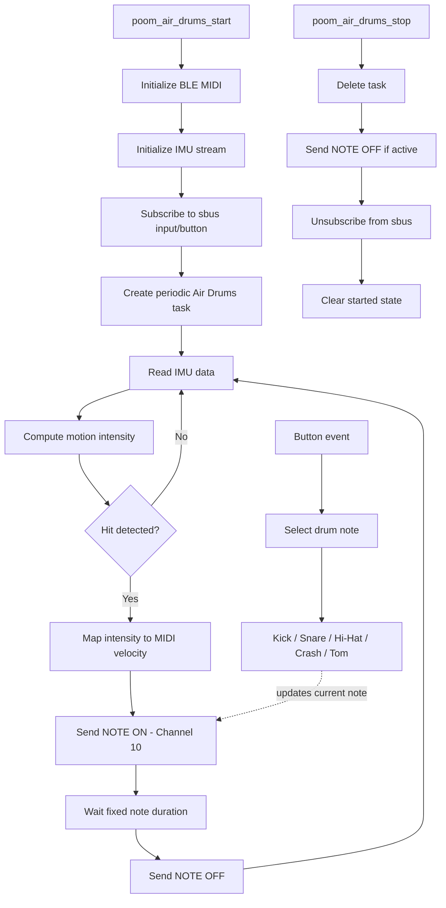

# poom_air_drums

`poom_air_drums` is a BLE MIDI application that turns IMU motion into drum hits.

The module reads acceleration and gyroscope data, estimates motion intensity, and sends MIDI drum notes on **channel 10**. Drum instrument selection is controlled through button events received over `sbus`.

## Directory Layout

```text
applications/poom_air_drums
├── CMakeLists.txt
├── include/
│   └── poom_air_drums.h
└── poom_air_drums.c
````

## Dependencies

Declared in `applications/poom_air_drums/CMakeLists.txt`:

* `ble_midi`
* `poom_imu_stream`
* `sbus`

## Public API

Header:
`applications/poom_air_drums/include/poom_air_drums.h`

```c
void poom_air_drums_start(void);
void poom_air_drums_stop(void);
```

## Overview

When started, the application:

1. Initializes the BLE MIDI stack.
2. Initializes the IMU stream interface.
3. Subscribes to button events on `input/button`.
4. Starts a periodic FreeRTOS task that evaluates motion.
5. Generates `NOTE ON` / `NOTE OFF` events on MIDI **channel 10**.

This makes the device behave like a motion-driven electronic drum controller over BLE MIDI.

## Runtime Flow

### `poom_air_drums_start()`

* Prevents double start.
* Calls BLE MIDI initialization.
* Initializes the IMU stream module.
* Subscribes to button events through `sbus`.
* Creates the Air Drums processing task.




### Air Drums task

The internal task runs periodically and executes one motion-processing step per iteration:

* reads IMU data,
* computes motion intensity from acceleration and angular rate,
* converts motion into MIDI velocity,
* sends `NOTE ON` when a hit is detected,
* sends `NOTE OFF` after a short fixed duration.

### `poom_air_drums_stop()`

* Stops and deletes the task.
* Sends `NOTE OFF` if a note is still active.
* Unsubscribes from button events.
* Clears the started state.

## Button-to-Drum Mapping

The active drum note is selected using button events.

Supported selection events:

* **single click**
* **double click**

Current mapping:

* `A` → `36` — Kick
* `B` → `38` — Snare
* `LEFT` → `42` — Closed Hi-Hat
* `RIGHT` → `46` — Open Hi-Hat
* `UP` → `49` — Crash
* `DOWN` → `45` — Low Tom

## Hit Detection

Hit detection is based on a combined motion metric derived from:

* total acceleration magnitude,
* dynamic acceleration relative to gravity,
* normalized gyroscope magnitude.

The generated motion value is normalized and converted into MIDI velocity.

The detector also applies:

* activation threshold,
* minimum interval between hits,
* fixed note duration before `NOTE OFF`.

Velocity is clamped to a valid MIDI range before transmission.

## MIDI Behaviour

* MIDI output uses **channel 10** (standard drum channel).
* A detected hit sends `NOTE ON`.
* After a short duration, the app sends `NOTE OFF`.
* The selected note depends on the most recent valid button selection event.

## Logging

The module uses optional `printf`-based logging controlled by these macros:

* `POOM_AIR_DRUMS_LOG_ENABLED`
* `POOM_AIR_DRUMS_DEBUG_LOG_ENABLED`

If these are not enabled through build flags or Kconfig, logging remains disabled.

## Notes

* The module currently includes a BLE MIDI RX callback for diagnostics.
* Button events are consumed only for note selection.
* The app is structured as a lightweight runtime task with explicit start/stop control.

