# poom_app_pack

## Guía del menú (español)

Este componente contiene las pantallas que se abren desde el menú de POOM.
La organización del proyecto es:

- [`applications/`](../): contiene los componentes de aplicación, incluidos el menú, este paquete y las implementaciones de funciones como NFC, detección Wi-Fi o control BLE.
- [`poom_menu`](../poom_menu/): dibuja las categorías, gestiona la navegación y decide qué aplicación abrir.
- **`poom_app_pack`**: implementa las pantallas `src/menu_*.c`, procesa sus botones y conecta cada pantalla con los componentes que realizan la función.

Las siguientes tablas siguen el orden de las listas `s_apps_*` de
[`poom_menu.c`](../poom_menu/src/poom_menu.c). Conservan los nombres que aparecen en la pantalla.

### Cómo navegar

- En la pantalla principal: **LEFT/RIGHT** cambia de categoría y **A** la abre.
- Dentro de una categoría: **UP/DOWN** selecciona una opción, **A** la ejecuta y **B** vuelve a las categorías.
- Dentro de una aplicación: los controles dependen de su pantalla. Generalmente **B** vuelve o sale; `TINY CONTROL` usa **LEFT+RIGHT** para salir.

### THE BEAST — Herramientas inalámbricas

| Opción del menú | Qué hace | Pantalla |
| --- | --- | --- |
| `CLI` | Abre la consola de POOM para comandos de aplicaciones, NFC, configuración y drones. Se utiliza desde la consola USB; la OLED muestra las indicaciones de acceso. | [menu_cli_nfc.c](src/menu_cli_nfc.c) |
| `OPENTHREAD CLI` | Abre la consola de OpenThread para configurar y consultar una red Thread. Solo aparece con `CONFIG_OPENTHREAD_ENABLED` y `CONFIG_OPENTHREAD_CLI` habilitados. | [menu_cli_ot.c](src/menu_cli_ot.c) |
| `DEAUTH` | Escanea puntos de acceso Wi-Fi, permite seleccionar uno y ejecutar modos de prueba activos, incluida la desautenticación. | [menu_deauth.c](src/menu_deauth.c) |
| `DEAUTH DET` | Detecta pasivamente tramas de desautenticación y muestra alertas, correlación de eventos y ajustes del detector. | [menu_deauth_detector.c](src/menu_deauth_detector.c) |
| `KARMA` | Ejecuta pruebas de respuesta a solicitudes de búsqueda de redes Wi-Fi y muestra el SSID activo y el estado de la sesión. | [menu_karma.c](src/menu_karma.c) |
| `SPAM WIFI` | Emite anuncios Wi-Fi con distintos SSID para pruebas de detección y carga de anuncios. | [menu_ssid_spam.c](src/menu_ssid_spam.c) |
| `SPAM BLE` | Emite anuncios BLE de los perfiles disponibles y permite cambiar el modo de emisión. | [menu_ble_spam.c](src/menu_ble_spam.c) |
| `CAPTIVE PORTAL` | Configura y ejecuta un punto de acceso con portal cautivo; permite preparar los parámetros de la red desde la pantalla. | [menu_captive.c](src/menu_captive.c) |
| `BLE DETECT` | Lista dispositivos BLE cercanos con intensidad de señal, detalles y alias. Incluye filtros `BLE DEVICES`, `TRACKERS` y `WEARABLES`; las coincidencias de firmas son indicios de tipo de dispositivo. | [menu_ble_detector.c](src/menu_ble_detector.c) |
| `WIFI DETECT` | Lista dispositivos Wi-Fi y permite filtrar `WIFI DEVICES`, `AP CLIENTS`, `FLOCK/ALPR` e `IP CAMERAS`. Muestra señal, detalles y alias; infiere clientes de un AP mediante observación pasiva. | [menu_wifi_detector.c](src/menu_wifi_detector.c) |
| `SNIFFER` | Captura tráfico Wi-Fi, BLE o IEEE 802.15.4/Zigbee en formato PCAP. Permite elegir modo y canal; muestra si la salida es SD o UART. | [menu_poom_pcap.c](src/menu_poom_pcap.c) |
| `SNNIFER RT` | Selecciona captura BLE o IEEE 802.15.4 para análisis en tiempo real desde un equipo conectado. En IEEE 802.15.4 permite seleccionar el canal. | [menu_sniffer_rt.c](src/menu_sniffer_rt.c) |
| `SCAN CHANNELS` | Muestra actividad por canal en Wi-Fi o IEEE 802.15.4. En Wi-Fi puede fijar un canal y mostrar tramas por segundo, reintentos, desautenticaciones y distribución por tipo de trama. | [menu_scanner_core.c](src/menu_scanner_core.c) |
| `SCAN NET` | Descubre equipos de la red local mediante ARP y muestra los parámetros de red y los resultados. | [menu_poom_wifi_arp.c](src/menu_poom_wifi_arp.c) |
| `CLI ZIGBEE` | Abre la consola de Zigbee para interactuar con sus comandos. Solo aparece con `CONFIG_ZB_ENABLED` habilitado. | [menu_cli_zigbee.c](src/menu_cli_zigbee.c) |
| `HTTP LOAD` | Genera peticiones HTTP hacia un servidor configurado para medir su comportamiento bajo carga; permite editar parámetros y ver contadores. | [menu_http_load_test.c](src/menu_http_load_test.c) |
| `PROBE REQ` | Monitoriza solicitudes de búsqueda de redes Wi-Fi (probe requests) y muestra una lista de observaciones con sus detalles. | [menu_sniffer_device.c](src/menu_sniffer_device.c) |

`SNNIFER RT` reproduce la etiqueta actual del firmware. Las dos consolas condicionales
también se incluyen o excluyen de la compilación en [CMakeLists.txt](CMakeLists.txt).

### THE ZEN — Música, NFC y control

| Opción del menú | Qué hace | Pantalla |
| --- | --- | --- |
| `MIDI` | Convierte movimiento en mensajes MIDI por BLE. Permite ajustar la nota, el umbral de golpe y el modo de percusión o melodía con escala mayor/menor. | [menu_midi.c](src/menu_midi.c) |
| `CONTROL` | Usa POOM como control multimedia BLE: envía acciones como reproducción/pausa y cambio de pista. | [menu_control_music.c](src/menu_control_music.c) |
| `NFC` | Abre las funciones `SCAN`, `AMIIBO`, `EMULATE`, `RESTORE MFC` y `STORAGE`: lectura de tarjetas, gestión de Amiibo, emulación compatible, restauración de MIFARE Classic y archivos guardados. | [menu_nfc.c](src/menu_nfc.c) |
| `PICOPASS` | Lee e inspecciona tarjetas PicoPass/iCLASS compatibles, muestra datos de la credencial y permite guardarlos en SD. | [menu_picopass.c](src/menu_picopass.c) |
| `IR UNIV` | Funciona como control remoto infrarrojo: aprende, guarda y transmite señales, y permite cargar archivos `.ir` desde la SD. | [menu_ir_universal.c](src/menu_ir_universal.c) |
| `POOM WEB` | Inicia la interfaz web local de POOM y muestra el estado de acceso para utilizar sus herramientas desde un navegador. | [menu_cli_web.c](src/menu_cli_web.c) |

### THE GAMER — Juegos y controles

| Opción del menú | Qué hace | Pantalla |
| --- | --- | --- |
| `GAME SLOT` | Ofrece `PLAY CURRENT GAME` para arrancar el juego instalado y `LOAD NEW BIN` para instalar un juego compatible desde un archivo `.bin` de la SD. Arrancar el juego reinicia el dispositivo. | [menu_poom_boot_policy.c](src/menu_poom_boot_policy.c) |
| `GAME STORE` | Navega por un catálogo de juegos y sus categorías, descarga juegos a la SD y permite instalarlos o ejecutar el instalado. Incluye descarga de todo el catálogo y consulta sin conexión de contenido guardado. | [menu_poom_game_store.c](src/menu_poom_game_store.c) |
| `TINY CONTROL` | Envía los botones de POOM como teclas de un controlador BLE HID para juegos. Muestra el estado de conexión; se sale con **LEFT+RIGHT**. | [menu_ble_control.c](src/menu_ble_control.c) |
| `WII` | Activa el controlador POOM WII mediante `poom_wii` y envía las pulsaciones de los botones al dispositivo conectado. | [menu_air_ble.c](src/menu_air_ble.c) |

### THE MAKER — Sensores y desarrollo

| Opción del menú | Qué hace | Pantalla |
| --- | --- | --- |
| `PLOT` | Visualiza y transmite datos de la IMU mediante las herramientas de gráficos/BLE. Permite seleccionar acelerómetro (`ACC`), giroscopio (`GYR`) o los seis ejes (`6AX`). | [menu_plot.c](src/menu_plot.c) |
| `DRONE SCAN` | Busca emisiones Remote ID de drones y muestra una lista con sus detalles. La captura PCAP en SD depende de la configuración del escáner. | [menu_poom_drone_scan.c](src/menu_poom_drone_scan.c) |
| `DRONE EMUL` | Emite mensajes Remote ID de prueba para comprobar el funcionamiento de receptores o del escáner. | [menu_poom_drone_emul.c](src/menu_poom_drone_emul.c) |
| `I2C` | Escanea el bus I2C y muestra las direcciones de los dispositivos que responden. | [menu_i2c_scan.c](src/menu_i2c_scan.c) |
| `LUA` | Selecciona y ejecuta scripts `.lua` desde la SD. La ruta inicial es `/sdcard/main.lua`. | [menu_lua.c](src/menu_lua.c) |
| `EDGE AI` | Ejecuta la integración de Edge Impulse y muestra el estado y los resultados del modelo incorporado. | [menu_edge_impulse.c](src/menu_edge_impulse.c) |

### SETTINGS — Configuración y archivos

| Opción del menú | Qué hace | Pantalla |
| --- | --- | --- |
| `BTN SOUND ON/OFF` | Activa o desactiva el sonido de los botones y guarda la preferencia. La etiqueta cambia según el estado; la acción se realiza en el propio menú. | [poom_menu.c](../poom_menu/src/poom_menu.c) |
| `DFU` | Inicia la actualización de firmware, muestra los datos de conexión y el progreso. Una actualización correcta reinicia el dispositivo. | [menu_dfu.c](src/menu_dfu.c) |
| `FW INFO` | Muestra la versión y los datos de compilación del firmware, junto con información de las particiones OTA. | [menu_fw_info.c](src/menu_fw_info.c) |
| `WI-FI` | Escanea redes, permite introducir credenciales, conectarse y guardar la configuración de conexión. | [menu_poom_wifi_scan.c](src/menu_poom_wifi_scan.c) |
| `SD` | Abre el explorador de archivos y carpetas de la tarjeta SD. | [menu_sd_browser.c](src/menu_sd_browser.c) |

### Opciones presentes en el código pero desactivadas en el menú

Estas entradas están comentadas en `poom_menu.c`, por lo que no aparecen al navegar:

| Categoría | Opción | Función implementada |
| --- | --- | --- |
| THE ZEN | `HARMONY` | Reproduce secuencias musicales desde archivos JSON de la SD y envía MIDI por BLE; incluye repetición. Véase [menu_midi_harmony.c](src/menu_midi_harmony.c). |
| THE ZEN | `TONE` | Reproduce tonos predefinidos o cargados desde SD en el buzzer. Véase [menu_tone.c](src/menu_tone.c). |
| THE GAMER | `BREAKOUT` | Abre el juego Breakout de [poom_breakout](../poom_breakout/). |
| THE MAKER | `BLE SCAN` | Abre el escáner de dispositivos BLE de [menu_ble_scan.c](src/menu_ble_scan.c). |
| THE MAKER | `DRONE ID` | Abre la pantalla de Remote ID de [menu_poom_droneid.c](src/menu_poom_droneid.c). |
| SETTINGS | `IMU` | Muestra lecturas del sensor de movimiento. Véase [menu_imu_monitor.c](src/menu_imu_monitor.c). |
| SETTINGS | `LED RGB` | Ajusta los canales rojo, verde y azul del LED WS2812. Véase [menu_ws2812_color.c](src/menu_ws2812_color.c). |
| SETTINGS | `BOOT` | Reinicia el dispositivo mediante la acción del lanzador. |
| SETTINGS | `NFC TUNE` | Consulta y ajusta la sintonización del lector NFC. Véase [menu_nfc_tuning.c](src/menu_nfc_tuning.c). |

Tener un archivo en `src/` no implica que exista una entrada visible: por ejemplo,
`menu_tracker.c` no tiene una entrada propia en las listas actuales y
`menu_detector_view.c` contiene utilidades compartidas de presentación.

## Technical reference (English)

`poom_app_pack` is the **application pack** behind the POOM on-device UI: a set of small OLED-first apps
that are launched from the top-level menu (`applications/poom_menu/`).

Each app:
- Renders to the OLED via `poom_arduboy_display` / `Arduboy2`
- Consumes button events via SBUS topic `input/button` (published by `button_driver`)
- Starts/stops the specific subsystem it needs (Wi‑Fi, BLE, NFC, IR, SD, etc.)
- Returns control to the launcher by publishing `poom/menu/resume`

## Purpose

- Provide a curated set of apps grouped by domain (THE BEAST / THE ZEN / THE GAMER / THE MAKER / SETTINGS)
- Offer a consistent, small-screen UI pattern (list selection, status screens, simple editors)
- Encapsulate subsystem lifecycles so apps can be started and stopped safely

## Structure

```text
applications/poom_app_pack/
├── CMakeLists.txt
├── component.mk
├── README.md
├── include/
│   ├── iconos.h
│   ├── menu_air_ble.h
│   ├── menu_ble_control.h
│   ├── menu_ble_detector.h
│   ├── menu_ble_scan.h
│   ├── menu_ble_spam.h
│   ├── menu_captive.h
│   ├── menu_cli_nfc.h
│   ├── menu_cli_ot.h
│   ├── menu_cli_web.h
│   ├── menu_cli_zigbee.h
│   ├── menu_control_music.h
│   ├── menu_deauth.h
│   ├── menu_deauth_detector.h
│   ├── menu_detector_view.h
│   ├── menu_dfu.h
│   ├── menu_edge_impulse.h
│   ├── menu_fw_info.h
│   ├── menu_http_load_test.h
│   ├── menu_i2c_scan.h
│   ├── menu_imu_monitor.h
│   ├── menu_ir_universal.h
│   ├── menu_karma.h
│   ├── menu_lua.h
│   ├── menu_midi.h
│   ├── menu_midi_harmony.h
│   ├── menu_nfc.h
│   ├── menu_nfc_tuning.h
│   ├── menu_picopass.h
│   ├── menu_plot.h
│   ├── menu_poom_boot_policy.h
│   ├── menu_poom_game_store.h
│   ├── menu_poom_pcap.h
│   ├── menu_poom_drone_emul.h
│   ├── menu_poom_drone_scan.h
│   ├── menu_poom_droneid.h
│   ├── menu_poom_wifi_arp.h
│   ├── menu_poom_wifi_scan.h
│   ├── menu_scanner_core.h
│   ├── menu_sd_browser.h
│   ├── menu_sniffer_device.h
│   ├── menu_sniffer_rt.h
│   ├── menu_ssid_spam.h
│   ├── menu_tone.h
│   ├── menu_tracker.h
│   ├── menu_wifi_detector.h
│   └── menu_ws2812_color.h
└── src/
    ├── menu_air_ble.c
    ├── menu_ble_control.c
    ├── menu_ble_detector.c
    ├── menu_ble_scan.c
    ├── menu_ble_spam.c
    ├── menu_captive.c
    ├── menu_cli_nfc.c
    ├── menu_cli_ot.c
    ├── menu_cli_web.c
    ├── menu_cli_zigbee.c
    ├── menu_control_music.c
    ├── menu_deauth.c
    ├── menu_deauth_detector.c
    ├── menu_detector_view.c
    ├── menu_dfu.c
    ├── menu_edge_impulse.c
    ├── menu_fw_info.c
    ├── menu_http_load_test.c
    ├── menu_i2c_scan.c
    ├── menu_imu_monitor.c
    ├── menu_ir_universal.c
    ├── menu_karma.c
    ├── menu_lua.c
    ├── menu_midi.c
    ├── menu_midi_harmony.c
    ├── menu_nfc.c
    ├── menu_nfc_tuning.c
    ├── menu_picopass.c
    ├── menu_plot.c
    ├── menu_poom_boot_policy.c
    ├── menu_poom_game_store.c
    ├── menu_poom_pcap.c
    ├── menu_poom_drone_emul.c
    ├── menu_poom_drone_scan.c
    ├── menu_poom_droneid.c
    ├── menu_poom_wifi_arp.c
    ├── menu_poom_wifi_scan.c
    ├── menu_scanner_core.c
    ├── menu_sd_browser.c
    ├── menu_sniffer_device.c
    ├── menu_sniffer_rt.c
    ├── menu_ssid_spam.c
    ├── menu_tone.c
    ├── menu_tracker.c
    ├── menu_wifi_detector.c
    └── menu_ws2812_color.c
```

## Menu Structure

The launcher (`applications/poom_menu/`) exposes these apps in 5 main categories.
The Spanish tables above preserve menu order and describe conditional entries.

```mermaid
graph TD
    A[POOM Main Menu] --> B[THE BEAST]
    A --> C[THE ZEN]
    A --> D[THE GAMER]
    A --> E[THE MAKER]
    A --> F[SETTINGS]

    B --> B1[DEAUTH]
    B --> B2[DEAUTH DET]
    B --> B3[KARMA]
    B --> B4[SPAM WIFI]
    B --> B5[SPAM BLE]
    B --> B6[CAPTIVE PORTAL]
    B --> B7[BLE DETECT]
    B --> B8[WIFI DETECT]
    B --> B9[SNIFFER]
    B --> B10[SNNIFER RT]
    B --> B11[SCAN CHANNELS]
    B --> B12[SCAN NET]
    B --> B13[CLI]
    B --> B14[HTTP LOAD]
    B --> B15[PROBE REQ]
    B --> B16[OPENTHREAD CLI - conditional]
    B --> B17[CLI ZIGBEE - conditional]

    C --> C1[MIDI]
    C --> C2[CONTROL]
    C --> C3[NFC]
    C --> C4[PICOPASS]
    C --> C5[IR UNIV]
    C --> C6[POOM WEB]

    D --> D1[GAME SLOT]
    D --> D2[TINY CONTROL]
    D --> D3[WII]
    D --> D4[GAME STORE]

    E --> E1[PLOT]
    E --> E2[DRONE SCAN]
    E --> E3[DRONE EMUL]
    E --> E4[I2C]
    E --> E5[LUA]
    E --> E6[EDGE AI]

    F --> F1[BTN SOUND]
    F --> F2[DFU]
    F --> F3[FW INFO]
    F --> F4[WI-FI]
    F --> F5[SD]
```



## Applications Reference

This section expands each app with:
- **What it is** (user-visible goal)
- **Subsystems** it uses (Wi‑Fi/BLE/NFC/IR/SD/…)
- **I/O** (OLED status, SD files, UART logs)
- **Exit/return** behavior (how it hands control back to the launcher)

### THE BEAST — Wireless & RF tools (authorized environments only)

#### DEAUTH (`menu_deauth.c`, `app_deauth()`)
- What it is: Wi‑Fi scanner + active test modes for controlled environments.
- Subsystems: `poom_wifi_scanner`, `poom_wifi_attacks` (Wi‑Fi radio).
- UI: multi-screen flow (idle → scanning → AP list → mode selection → running).
- I/O: on-screen status; additional details via UART logs.
- Exit/return: exits to launcher and publishes `poom/menu/resume`.

#### DEAUTH DET (`menu_deauth_detector.c`, `app_deauth_detector()`)
- What it is: passive deauth-detector dashboard (alert level + correlation/reason views + basic settings).
- Subsystems: `poom_wifi_deauth_detector`.
- UI: multiple pages (overview/correlation/reason/settings).
- I/O: OLED-only summary; intended to be “always-on” during a session.
- Exit/return: exits to launcher and publishes `poom/menu/resume`.

#### KARMA (`menu_karma.c`, `menu_karma_init()`)
- What it is: probe-response/association behavior test tool for lab setups.
- Subsystems: `poom_wifi_karma` (Wi‑Fi radio).
- UI: status screen + current active SSID text.
- I/O: OLED status; UART logs for deeper debugging.
- Exit/return: exits to launcher and publishes `poom/menu/resume`.

#### SPAM WIFI (`menu_ssid_spam.c`, `menu_ssid_spam_init()`)
- What it is: Wi‑Fi beacon/SSID advertising stress-test tool.
- Subsystems: `poom_wifi_spam`.
- UI: simple start/stop + status.
- I/O: OLED status; RF output.
- Exit/return: exits to launcher and publishes `poom/menu/resume`.

#### SPAM BLE (`menu_ble_spam.c`, `menu_ble_spam_display()`)
- What it is: BLE advertising stress-test / compatibility test helper.
- Subsystems: `poom_ble_spam`.
- UI: status + mode cycling (implementation-defined).
- I/O: OLED status; BLE advertising traffic.
- Exit/return: exits to launcher and publishes `poom/menu/resume`.

#### CAPTIVE PORTAL (`menu_captive.c`, `menu_captive_display()`)
- What it is: captive-portal lab demo for web UI flows and device behavior testing.
- Subsystems: `poom_wifi_captive`, `poom_wifi_scanner`, `poom_ui_keyboard`, `sd_card`.
- UI: on-device setup + text entry (via on-screen keyboard) for test network parameters as needed by the demo.
- I/O: may read/write configuration/assets from SD depending on build; OLED status for run state.
- Exit/return: exits to launcher and publishes `poom/menu/resume`.

#### BLE DETECT (`menu_ble_detector.c`, `menu_ble_detector_show()`)
- What it is: passive BLE inventory and local detector with `BLE DEVICES`, `TRACKERS`, and `WEARABLES` filters.
- Subsystems: `poom_ble_detector`, `poom_ble_scan`, `poom_ui_keyboard`, `poom_secrets_store`.
- UI: up to 12 records with live RSSI, scrolling selected names, detail view, and persistent aliases.
- Detection: recognizes supported AirTag, SmartTag, Tile, Find My-style, smart-glasses, and body-camera signatures. Matches are candidates rather than proof of identity.
- Exit/return: exits to launcher and publishes `poom/menu/resume`.

#### WIFI DETECT (`menu_wifi_detector.c`, `menu_wifi_detector_show()`)
- What it is: local Wi-Fi inventory and detector with `WIFI DEVICES`, `AP CLIENTS`, `FLOCK/ALPR`, and `IP CAMERAS` filters.
- Subsystems: `poom_wifi_detector`, `poom_wifi_scanner`, `poom_wifi_ctrl`, `poom_ui_keyboard`, `poom_secrets_store`.
- UI: up to 12 deduplicated records with live RSSI, scrolling selected names, AP selection, a scrollable client list, detail view, and persistent aliases.
- Detection: uses SSID keywords, OUI/MAC signatures, and passive promiscuous observations. `AP CLIENTS` fixes the selected AP channel and infers active client relationships from `ToDS`/`FromDS` data-frame addresses without associating to the AP.
- Exit/return: stops scans and promiscuous monitoring, releases runtime storage, and publishes `poom/menu/resume`.

#### SNIFFER (`menu_poom_pcap.c`, `menu_poom_pcap_show()`)
- What it is: capture packets into PCAP for later analysis.
- Subsystems: `poom_pcap_manager`, plus radios depending on selected capture mode (Zigbee / Wi‑Fi / BLE).
- UI: mode select + channel/config screens + running screen.
- I/O: output target shows as `SD` when a PCAP file path is available, otherwise `UART`.
- Exit/return: stops capture, returns to launcher, publishes `poom/menu/resume`.

#### SNNIFER RT (`menu_sniffer_rt.c`, `menu_sniffer_rt_show()`)
- What it is: real-time capture selector for BLE and IEEE 802.15.4 host-assisted analysis.
- Subsystems: `poom_ble_scan`, `poom_ieee802154_sniffer`, and the host transport path.
- UI: selects BLE or IEEE 802.15.4; the latter also selects the capture channel.
- Exit/return: stops the active capture path and returns control to the launcher.

#### SCAN CHANNELS (`menu_scanner_core.c`, `menu_scanner_core_show()`)
- What it is: real-time RF/channel activity view (Wi‑Fi vs IEEE 802.15.4).
- Subsystems: `poom_scanner_core`.
- UI: mode select + channel list view with activity bars. On Wi-Fi, `A:AIR` fixes the highlighted channel and opens `WIFI AIR`; `A:MIX` then shows Data/Management/Control percentages and RTS/CTS rates.
- Wi-Fi metrics: one-second observation windows report frames/s, retry percentage and deauths/s. They do not claim exact RF airtime or channel-load percentage.
- I/O: OLED-only.
- Exit/return: exits to launcher and publishes `poom/menu/resume`.

#### SCAN NET (`menu_poom_wifi_arp.c`, `menu_poom_wifi_arp_show()`)
- What it is: local network discovery/ARP tooling for diagnostics on authorized networks.
- Subsystems: `poom_wifi_ctrl` (connectivity), `poom_wifi_arp`, `poom_secrets_store` (remembered settings).
- UI: list/detail screens for network parameters and results.
- I/O: OLED status; may log to UART for debugging.
- Exit/return: exits to launcher and publishes `poom/menu/resume`.

#### CLI (`menu_cli_nfc.c`, `menu_cli_nfc()`)
- What it is: POOM console entry point registering application, NFC, configuration, and drone commands; the OLED screen retains the `CLI NFC` title.
- Subsystems: `poom_cli` (POOM console core), `cli_nfc`, `poom_nfc`.
- UI: shows minimal status/ownership; primary interaction is via the CLI interface.
- I/O: USB console; may use NFC peripherals.
- Exit/return: returns to launcher and publishes `poom/menu/resume`.

#### OPENTHREAD CLI (`menu_cli_ot.c`, `menu_cli_ot()`)
- What it is: OpenThread console for configuring and inspecting Thread operation.
- Availability: requires both `CONFIG_OPENTHREAD_ENABLED` and `CONFIG_OPENTHREAD_CLI`.
- I/O: console commands and OLED status.

#### CLI ZIGBEE (`menu_cli_zigbee.c`, `menu_cli_zigbee()`)
- What it is: entry point to the Zigbee command console.
- Availability: requires `CONFIG_ZB_ENABLED`.
- I/O: console commands and OLED status.

#### HTTP LOAD (`menu_http_load_test.c`, `menu_http_load_test_show()`)
- What it is: on-device HTTP load generator for testing servers you control.
- Subsystems: `poom_http_load_test`, `poom_wifi_ctrl`, `poom_secrets_store` (host/params persistence).
- UI: parameter editing + start/stop + status counters.
- I/O: OLED status; generates HTTP traffic; logs for debugging.
- Exit/return: stops run and publishes `poom/menu/resume`.

#### PROBE REQ (`menu_sniffer_device.c`, `menu_sniffer_device_show()`)
- What it is: Wi‑Fi probe-request monitor UI.
- Subsystems: `poom_sniffer_device`.
- UI: list UI for recent entries + detail screen.
- I/O: OLED status; optional UART logs.
- Exit/return: exits to launcher and publishes `poom/menu/resume`.

### THE ZEN - Creative Control Suite

#### MIDI (`menu_midi.c`, `menu_midi_init()`)
- What it is: BLE MIDI controller / performance UI.
- Subsystems: `ble_midi`, `poom_motion_midi`, `i2c` (hardware inputs), SBUS buttons.
- UI: on-device controller screen; behavior depends on current MIDI mapping/profile.
- I/O: BLE MIDI output; OLED status.
- Exit/return: exits to launcher and publishes `poom/menu/resume`.

#### CONTROL (`menu_control_music.c`, `menu_control_init()`)
- What it is: “media keys” style BLE HID control (play/pause, next/prev, etc.).
- Subsystems: `poom_ble_keyboard` (HID), SBUS buttons.
- I/O: BLE HID events; OLED status.
- Exit/return: exits to launcher and publishes `poom/menu/resume`.

#### NFC (`menu_nfc.c`, `menu_nfc_show()`)
- What it is: NFC reader/emulator tooling UI.
- Subsystems: `poom_nfc_controller`, `poom_nfc_dump`, `poom_nfc_emulator`, `poom_nfc_store`, `sd_card`.
- Storage: supports SD card `.nfc` files and on-device store, depending on selected mode.
- I/O: OLED status; NFC I/O; optional UART logs.
- Exit/return: exits to launcher and publishes `poom/menu/resume`.

#### PICOPASS (`menu_picopass.c`, `menu_picopass_show()`)
- What it is: PicoPass/iCLASS credential reader and inspection UI for authorized cards.
- Subsystems: `poom_picopass`, `poom_nfc`, and `sd_card`.
- Storage: can save supported card data and decoded credential information to SD.
- I/O: OLED results, NFC communication, and optional diagnostic logs.
- Exit/return: stops polling and publishes `poom/menu/resume`.

#### IR UNIV (`menu_ir_universal.c`, `menu_ir_universal_show()`)
- What it is: universal IR remote (learn/store/transmit) UI.
- Subsystems: `ir`, `ir_tx`, `ir_dec`, `poom_led_rainbow`, `poom_sd_browser`, `poom_secrets_store`.
- Storage: browses `.ir` files from SD (start directory defaults to `/sdcard`); remembers selections via secrets store.
- I/O: IR RX/TX; OLED status; optional UART logs for debugging.
- Exit/return: exits to launcher and publishes `poom/menu/resume`.

#### POOM WEB (`menu_cli_web.c`, `menu_cli_web_show()`)
- What it is: local web UI + device-side CLI bridging.
- Subsystems: `poom_web`, `esp_console`, VFS; can integrate NFC CLI (`cli_nfc`) depending on build.
- I/O: HTTP server + OLED status; may expose limited CLI endpoints for local network use.
- Exit/return: exits to launcher and publishes `poom/menu/resume`.

### THE GAMER - Gaming Applications

#### GAME SLOT (`menu_poom_boot_policy.c`, `menu_poom_boot_policy_show()`)
- What it is: launcher for a game image installed in the secondary application slot.
- Subsystems: `poom_boot_policy`, OTA partitions, `poom_sd_browser`, and `sd_card`.
- Storage: can select and install a compatible `.bin` game image from SD.
- Exit/return: either returns to the launcher or reboots into the selected game image.

#### GAME STORE (`menu_poom_game_store.c`, `menu_poom_game_store_show()`)
- What it is: game catalog browser with categories, downloads, installation, and launch of the installed game.
- Subsystems: `poom_game_store`, `poom_boot_policy`, `poom_wifi_ctrl`, and `poom_secrets_store`.
- Storage: downloads games to SD and supports browsing cached content offline; also offers downloading the whole catalog.
- Exit/return: returns to the launcher or reboots into a game when launching it.

#### TINY CONTROL (`menu_ble_control.c`, `menu_control_display()`)
- What it is: minimal BLE HID “keyboard-like” controller UI intended for games.
- Subsystems: `poom_ble_keyboard`.
- UI: pairing/connected status; exits via chord (LEFT+RIGHT) so `B` can be used as a HID key.
- I/O: BLE HID events; OLED status.
- Exit/return: stops BLE keyboard module and publishes `poom/menu/resume`.

#### WII (`menu_air_ble.c`, `menu_air_ble_display()`)
- What it is: “POOM WII” controller mapping (sends keypresses over the `poom_wii` backend).
- Subsystems: `poom_wii`.
- UI: init/running state screen; sends key presses while buttons are held.
- I/O: host-side key events over the configured transport; OLED status.
- Exit/return: stops the backend, releases keys, publishes `poom/menu/resume`.

### THE MAKER - Development Tools

#### PLOT (`menu_plot.c`, `menu_plot_init()`)
- What it is: quick entry point to live plots (IMU stream/plot and BLE plotting tools).
- Subsystems: `poom_imu_stream`, `poom_imu_plot`, `poom_ble_plot`, `poom_imu_stream`, `poom_led_rainbow`.
- I/O: OLED plot UI; optional BLE streaming depending on mode.
- Exit/return: exits to launcher and publishes `poom/menu/resume`.

#### DRONE SCAN (`menu_poom_drone_scan.c`, `menu_poom_drone_scan_show()`)
- What it is: RemoteID scanner UI (lab tool; integrates with drone modules).
- Subsystems: `poom_drone` (scanner), timer/queue based UI refresh.
- Storage: optional “PCAP to SD” capture toggles exist in config (defaults off).
- I/O: OLED list + details; optional SD logging when enabled.
- Exit/return: exits to launcher and publishes `poom/menu/resume`.

#### DRONE EMUL (`menu_poom_drone_emul.c`, `menu_poom_drone_emul_show()`)
- What it is: RemoteID emulator UI for controlled testing of the scanner.
- Subsystems: `poom_drone_emul` (emulation), `poom_drone` (shared types).
- I/O: OLED status; emits test beacons/frames per configured emulation mode.
- Exit/return: stops emulation and publishes `poom/menu/resume`.

#### I2C
- What it is: on-device I2C scan is exposed as the external app `menu_i2c_scan_show()`.
- Note: the launcher only delegates to this app from Maker; the scan UI no longer lives in `applications/poom_menu/src/poom_menu.c`.

#### LUA (`menu_lua.c`, `menu_lua_show()`)
- What it is: Lua runner UI.
- Subsystems: `poom_lua`, `poom_sd_browser`.
- Storage: default entry path is `/sdcard/main.lua`; file browser filters `.lua`.
- I/O: OLED status; script output/logs typically go to UART depending on script.
- Exit/return: exits to launcher and publishes `poom/menu/resume`.

#### EDGE AI (`menu_edge_impulse.c`, `menu_edge_impulse_show()`)
- What it is: Edge Impulse integration UI (run model, show status/results).
- Subsystems: `poom_edge_impulse`.
- I/O: OLED status; model-specific logs may go to UART.
- Exit/return: exits to launcher and publishes `poom/menu/resume`.

### SETTINGS - System Configuration

#### BTN SOUND
- What it is: persistent toggle for button feedback sounds.
- UI: the launcher label reflects the current enabled/disabled setting.
- Exit/return: toggles immediately without leaving the Settings list.

#### DFU (`menu_dfu.c`, `dfu_start_task()`)
- What it is: device firmware update (DFU) modal UI.
- Subsystems: `poom_fw_update` + `dfu` + `poom_dfu_log` (uses a local update flow, typically via `poom.local`).
- UI: shows the AP SSID/password to connect to, then progress/status screens.
- I/O: OLED progress/status; firmware update traffic depending on configured transport.
- Exit/return: does not publish `poom/menu/resume`; successful updates reboot, errors remain on the DFU screen.

#### FW INFO (`menu_fw_info.c`, `menu_fw_info_show()`)
- What it is: firmware metadata screen (build version + OTA slot/partition info).
- Subsystems: `esp_app_desc`, `esp_ota_ops`.
- I/O: OLED-only.
- Exit/return: publishes `poom/menu/resume` when exiting.

#### WI‑FI (`menu_poom_wifi_scan.c`, `menu_poom_wifi_scan_show()`)
- What it is: Wi‑Fi scan + connect/config UI for legitimate network management.
- Subsystems: `poom_wifi_ctrl`, `poom_wifi_scanner`, `poom_ui_keyboard`, `poom_secrets_store`.
- Storage: stores network credentials/settings via secrets store.
- I/O: OLED status; Wi‑Fi connectivity.
- Exit/return: publishes `poom/menu/resume` on exit.

#### SD (`menu_sd_browser.c`, `app_sd_browser_menu()`)
- What it is: SD file browser UI.
- Subsystems: `poom_sd_browser`, `sd_card`.
- I/O: OLED list UI; file reads/writes depend on invoked actions.
- Exit/return: publishes `poom/menu/resume` on exit.

## Dependencies

Defined in `applications/poom_app_pack/CMakeLists.txt`:

- UI + control plane: `poom_sbus`, `poom_arduboy_display`, `button_driver`
- Persistence: `poom_secrets_store`
- Storage: `sd_card`, `poom_sd_browser`
- Wireless: `poom_wifi_ctrl`, `poom_wifi_scanner`, `poom_wifi_detector`, `poom_ble_scan`, `poom_ble_detector`, `poom_ble_keyboard`, `poom_ble_spam`, `poom_ble_tracker`
- NFC/IR: `poom_nfc`, `poom_picopass`, `ir` (IR TX/RX are both used by the IR app through this component)
- Tooling apps: `poom_pcap`, `poom_scanner_core`, `poom_sniffer_device`, `poom_boot_policy`, `poom_game_store`, `poom_edge_impulse`, `poom_http_load_test`, `poom_web`, `poom_lua`, `poom_midi`

## Entry points (public headers)

Each app has a small “launch” function declared in the matching header under `applications/poom_app_pack/include/`.
The **Applications Reference** above already lists the canonical entry point next to each `.c` file.

Notes:
- Naming isn’t fully uniform historically: some entries are `menu_*_show()`, others are `app_*()` or `*_init()`.
- DFU is started via `dfu_start_task()` from `applications/poom_app_pack/include/menu_dfu.h` (it is modal and does not return to the launcher).

## Runtime Behavior

- Most apps follow the same lifecycle:
  - Subscribe to `input/button` and render an initial frame
  - Run until an exit condition occurs (often `B`, sometimes a chord)
  - Stop/cleanup their subsystem(s)
  - Publish a token to `poom/menu/resume` so the launcher re-attaches its input handlers

## Firmware Version

Firmware version is provided by ESP-IDF `esp_app_desc_t.version` (build-time `PROJECT_VER`).

- **FW INFO** screen shows version/build metadata and OTA slots.
- DFU mode shows the current version via the OTA status JSON (`current_fw_version`).
- The runtime `get_version` tool returns `POOM <PROJECT_VER>`.

- **Navigation Controls**:
  - LEFT/RIGHT: Switch between menu categories
  - UP/DOWN: Navigate within category applications
  - A: Select and launch application
  - B: Exit menu (when applicable)

- **Application Launching**:
  - Detaches menu task to free resources
  - Publishes launch message to SBUS
  - Calls application-specific initialization
  - Applications run independently until completion

- **Menu Categories**:
  - **THE BEAST**: Wireless security testing tools
  - **THE ZEN**: Creative and control applications
  - **THE GAMER**: Gaming and controller applications
  - **THE MAKER**: Development and prototyping tools
  - **SETTINGS**: System configuration and utilities

## Integration

The menu system integrates with:

- **SBUS**: For inter-module communication and event handling
- **OLED Display**: For visual interface rendering
- **Button Driver**: For user input processing
- Prefer clean stop on exit: unsubscribe SBUS handlers, stop radio modules, and release IR or BLE resources.
- Keep OLED text short because most UIs assume about 18 to 22 characters per line depending on font.
- When adding SD-based content, document the directory, expected file extension, and whether files are created automatically or must be provisioned first.
- **Application Modules**: Individual feature implementations
- **System Services**: BLE, WiFi, NFC, and hardware peripherals
