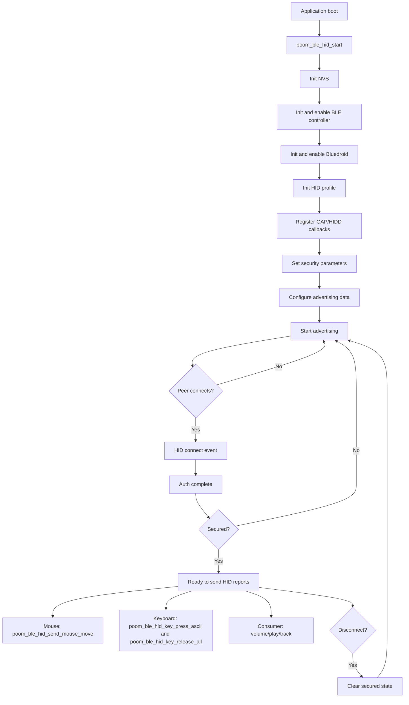

# poom_ble_hid

`poom_ble_hid` is a BLE HID component for ESP-IDF that exposes:
- Consumer control reports (media keys).
- Keyboard ASCII reports.
- Relative mouse reports.
- BLE connection callback integration.

The module wraps ESP-IDF Bluedroid HID primitives with a compact API that is used by higher-level applications such as `poom_wii`, `poom_ble_keyboard`, and `poom_game_snake`.

## Structure

```text
applications/poom_ble_hid/
├── CMakeLists.txt
├── component.mk
├── poom_ble_hid.c
├── esp_hidd_prf_api.c          # third-party / ESP-IDF derived
├── esp_hidd_prf_api.h          # third-party / ESP-IDF derived
├── hid_dev.c                   # third-party / ESP-IDF derived
├── hid_dev.h                   # third-party / ESP-IDF derived
├── hid_device_le_prf.c         # third-party / ESP-IDF derived
├── hidd_le_prf_int.h           # third-party / ESP-IDF derived
└── include/
    └── poom_ble_hid.h
```

## Runtime Flow



## Public API

- Initialization and state:
  - `poom_ble_hid_start`
  - `poom_ble_hid_set_connection_callback`
- Consumer control:
  - `poom_ble_hid_send_volume_up`, `poom_ble_hid_send_volume_down`
  - `poom_ble_hid_send_play`, `poom_ble_hid_send_pause`
  - `poom_ble_hid_send_next_track`, `poom_ble_hid_send_prev_track`
- Mouse:
  - `poom_ble_hid_send_mouse_move`
- Keyboard:
  - `poom_ble_hid_key_press_ascii`
  - `poom_ble_hid_key_release_all`

