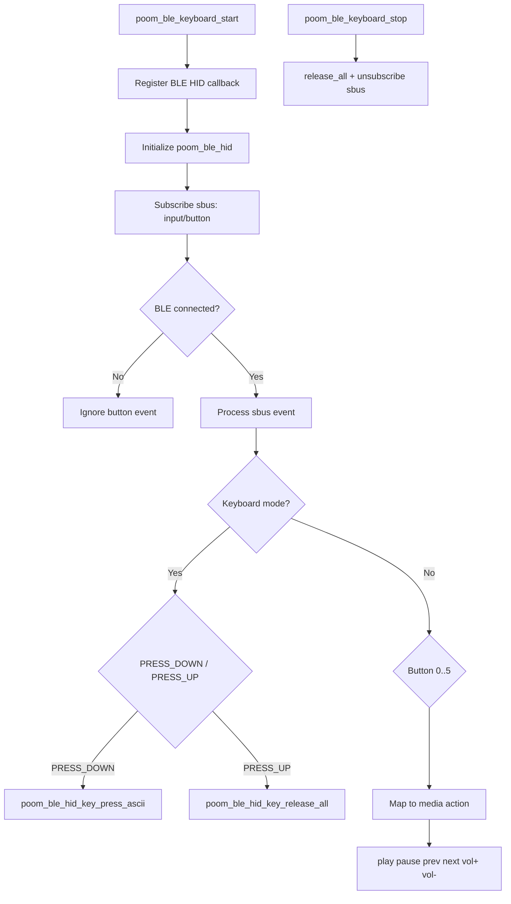

# poom_ble_keyboard

Component for BLE HID control with button events through `sbus`.

## Purpose

- Initialize the BLE keyboard module.
- Listen for button events (`input/button`).
- Send HID actions in keyboard or media mode.
- Notify BLE connection state changes through a callback.

## Structure

```text
applications/poom_ble_keyboard
├── CMakeLists.txt
├── component.mk
├── include/
│   └── poom_ble_keyboard.h
├── poom_ble_keyboard.c
└── README.md
```

## Public API

- `void poom_ble_keyboard_start(void);`
- `void poom_ble_keyboard_stop(void);`
- `void poom_ble_keyboard_set_keyboard_mode(bool enabled);`
- `void poom_ble_keyboard_set_connection_callback(poom_ble_keyboard_connection_cb_t cb);`

## Flow (Mermaid)



## Logging

The module uses logging macros controlled by:

- `POOM_BLE_KEYBOARD_ENABLE_LOG`
- `POOM_BLE_KEYBOARD_DEBUG_LOG_ENABLED`

## Dependencies

- `poom_ble_hid`
- `sbus`
- `bt`
- `nvs_flash`
- `board`
