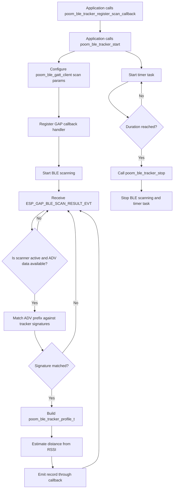

# poom_ble_tracker

`poom_ble_tracker` is a BLE scanner component that detects known tracker advertisement signatures (for example AirTag and Tile), estimates distance from RSSI, and streams parsed records through a callback.

## Features

- Starts and stops BLE scanning through `poom_ble_gatt_client`.
- Detects tracker signatures from advertisement payload prefixes.
- Provides parsed records with:
  - Name and vendor.
  - MAC address.
  - RSSI.
  - Estimated distance.
- Supports callback-based integration with UI modules.
- Exposes utility APIs to manage dynamic tracker profile lists.

## Structure

```text
applications/poom_ble_tracker/
├── CMakeLists.txt
├── component.mk
├── poom_ble_tracker.c
├── README.md
└── include/
    └── poom_ble_tracker.h
```

## Runtime Flow



## Public API

- `poom_ble_tracker_register_scan_callback`
- `poom_ble_tracker_start`
- `poom_ble_tracker_stop`
- `poom_ble_tracker_is_active`
- `poom_ble_tracker_add_profile`
- `poom_ble_tracker_find_profile_by_mac`

## Dependencies

Defined in `applications/poom_ble_tracker/CMakeLists.txt`:

- `bt`
- `poom_ble_gatt_client`

