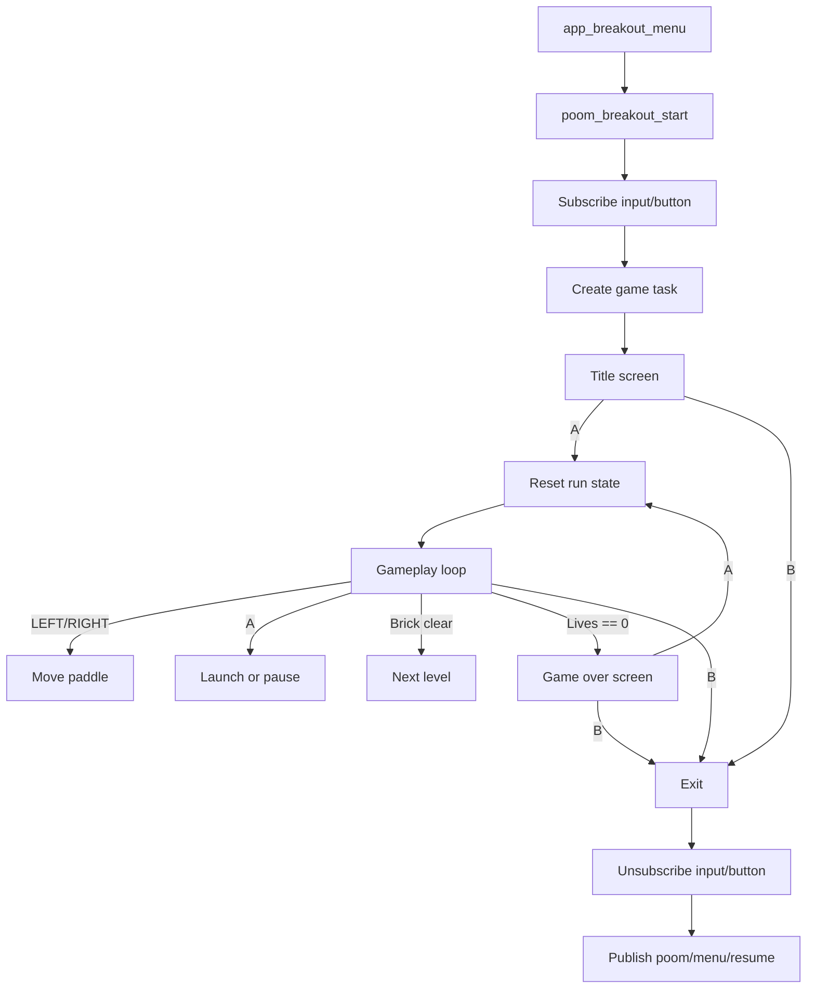

# poom_breakout

`poom_breakout` is a compact OLED arcade app for POOM inspired by the migrated `ArduBreakout.ino`.
It keeps the core loop native to this firmware stack: SBUS button input, Arduboy-style rendering, buzzer cues,
and clean return to the launcher.

## Purpose

- Add a real game entry under `THE GAMER`.
- Reuse the Breakout-style paddle / ball / brick gameplay from the migration draft.
- Follow the same launcher contract as other `applications`: subscribe buttons, render on OLED, and return with `poom/menu/resume`.

## Structure

- `poom_breakout.c`
  - Game loop task, input handling, rendering, and launcher resume callback.
- `include/poom_breakout.h`
  - Public start/stop API and menu entry helper.
- `CMakeLists.txt`
  - Component registration and dependencies.

## Usage

- `A`: start game from title, launch ball, pause/resume, restart after game over.
- `LEFT` / `RIGHT`: move paddle while held.
- `B`: exit back to launcher.

Gameplay notes:

- Score increases by `level * 10` per brick.
- Clearing all bricks advances to the next level.
- High score is kept in RAM for the current boot/session.
- This first firmware port does not persist initials or scores to storage yet.

## Public API

```c
esp_err_t poom_breakout_start(void);
esp_err_t poom_breakout_stop(void);
bool poom_breakout_is_running(void);
esp_err_t poom_breakout_set_exit_callback(poom_breakout_exit_cb_t callback, void *user_ctx);

void app_breakout_menu(void);
```

## Integration

```c
#include "poom_breakout.h"

void launch_breakout(void)
{
    app_breakout_menu();
}
```

`app_breakout_menu()` is the launcher-oriented helper used by `poom_menu`.
It starts the game and publishes `poom/menu/resume` when the user exits.

## Runtime Behavior


