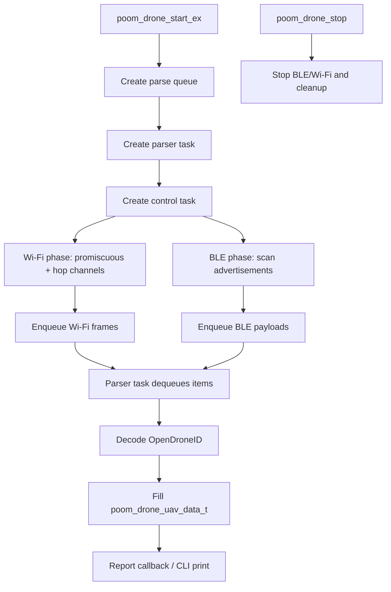

# poom_drone

`poom_drone` is a DroneID/RemoteID (OpenDroneID) scanner. It captures **Wi‑Fi management frames** in promiscuous mode and/or **BLE advertisements**, decodes OpenDroneID payloads, and emits reports via callback (and optionally via `printf()`).

## Purpose

- **Wi‑Fi NAN**: Action Frames carrying a Message Pack (RemoteID over NAN).
- **Wi‑Fi Beacon**: Vendor IE (ASTM / DJI / other supported OUIs) carrying a Message Pack.
- **BLE**: Service Data UUID `0xFFFA` (RemoteID) carrying ODID messages.

## Runtime Behavior

- Non-blocking promiscuous callback (enqueue only).
- Dedicated parser task for decoding.
- Country-based allowed channel list (2.4 GHz; adds 5 GHz on ESP32‑C5).
- Optional Wi‑Fi/BLE phase switching to reduce RF contention.
- Optional PCAP capture to SD (Wi‑Fi only).
- Start/stop lifecycle API with full task/queue/Wi‑Fi/BLE cleanup.
- Bounds/length checks to reduce crashes from malformed frames.

## Structure

```text
applications/poom_drone/
├── CMakeLists.txt
├── component.mk
├── poom_drone.c
├── README.md
└── include/
    └── poom_drone.h
```

## Public API

- `esp_err_t poom_drone_start(void);`
- `esp_err_t poom_drone_start_ex(const poom_drone_config_t *cfg);`
- `esp_err_t poom_drone_stop(void);`
- `void poom_drone_register_report_cb(poom_drone_report_cb_t cb, void *user_ctx);`

Config (`poom_drone_config_t`):
- `scan_mask`: `POOM_DRONE_SCAN_WIFI` and/or `POOM_DRONE_SCAN_BLE`
- `hop_interval_ms`: Wi‑Fi channel hop interval
- `wifi_phase_ms` / `ble_phase_ms`: used when both are enabled (time-slicing)
- `enable_pcap_to_sd`: PCAP to SD (Wi‑Fi)
- `enable_cli_print`: prints each report over UART

## Usage

In the current firmware, the launcher exposes two apps:
- `THE MAKER -> DRONE SCAN`: list + detail UI (uses `poom_drone` underneath).
- `THE MAKER -> DRONE EMUL`: emulator (see `applications/poom_drone_emul/README.md`).

Controls in `DRONE SCAN`:
- List:
  - `UP/DOWN`: move selection
  - `A`: open details for selected drone
  - `LEFT/RIGHT`: toggle BLE scan (`LR:BLE`)
  - `B`: exit
- Detail:
  - `UP/DOWN`: scroll
  - `B`: back

## Integration



## Runtime Behavior

- If you're associated to an AP, the radio can get “stuck” on the AP channel; this module attempts to disconnect before enabling promiscuous mode, but if you see few results, verify your Wi‑Fi state.
- For NAN, many emitters are only visible when you are listening on the right channel (keep `hop_interval_ms` low if the drone transmits sparsely).
- If “Beacon” decoding fails, it is usually because the Vendor IE is not RemoteID or the lengths don't match; the parser is designed to ignore non‑ODID IEs and keep scanning.
