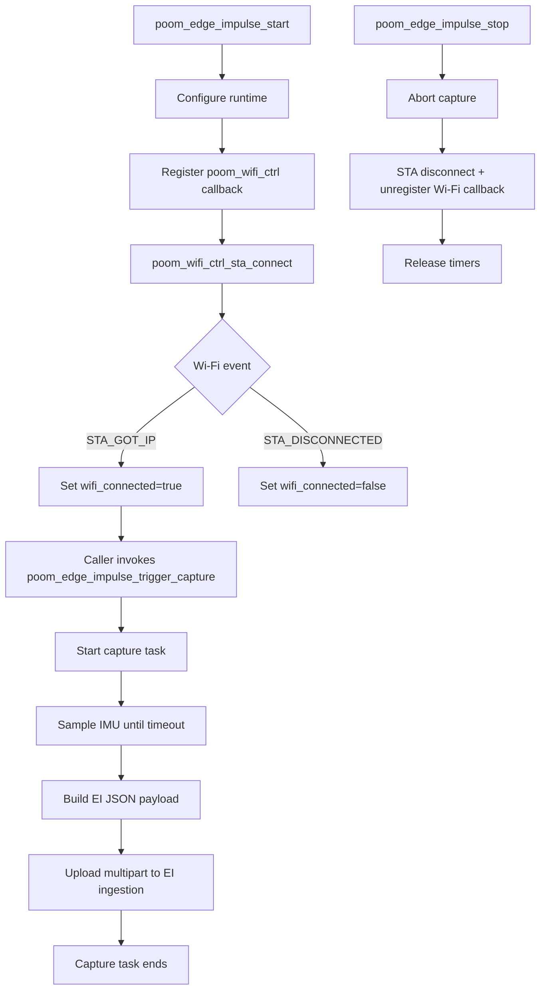

# poom_edge_impulse

`poom_edge_impulse` captures IMU samples (accelerometer, gyroscope, temperature), builds an Edge Impulse ingestion payload, and uploads it when triggered by the caller.

## Features

- Uses `poom_wifi_ctrl` for STA Wi-Fi connection and event handling.
- Uses `poom_imu_stream` for sensor sampling.
- Exposes `poom_edge_impulse_trigger_capture()` so menu/application code controls when a capture is sent.
- Uploads as multipart form-data to Edge Impulse ingestion API.

## Structure

- `poom_edge_impulse.c`: runtime state, Wi-Fi integration, capture task, upload logic.
- `include/poom_edge_impulse.h`: public API.

## Public API

- `esp_err_t poom_edge_impulse_get_default_config(poom_edge_impulse_config_t* out_config);`
- `esp_err_t poom_edge_impulse_start(const poom_edge_impulse_config_t* config);`
- `esp_err_t poom_edge_impulse_stop(void);`
- `esp_err_t poom_edge_impulse_trigger_capture(const char* label);`
- `esp_err_t poom_edge_impulse_get_state(bool* out_initialized, bool* out_wifi_connected, bool* out_capture_running);`

## Trigger Model

`poom_edge_impulse` does not subscribe to buttons directly.  
Your menu/application decides button mapping and calls:

- `poom_edge_impulse_trigger_capture("button_up");`
- `poom_edge_impulse_trigger_capture("button_down");`

## Usage

```c
#include "poom_edge_impulse.h"

void app_start_edge_impulse(void)
{
    poom_edge_impulse_config_t cfg;

    if (poom_edge_impulse_get_default_config(&cfg) != ESP_OK) {
        return;
    }

    cfg.wifi_ssid = "MySSID";
    cfg.wifi_password = "MyPassword";
    cfg.label = "imu-default";

    (void)poom_edge_impulse_start(&cfg);
}
```

## Runtime Flow


