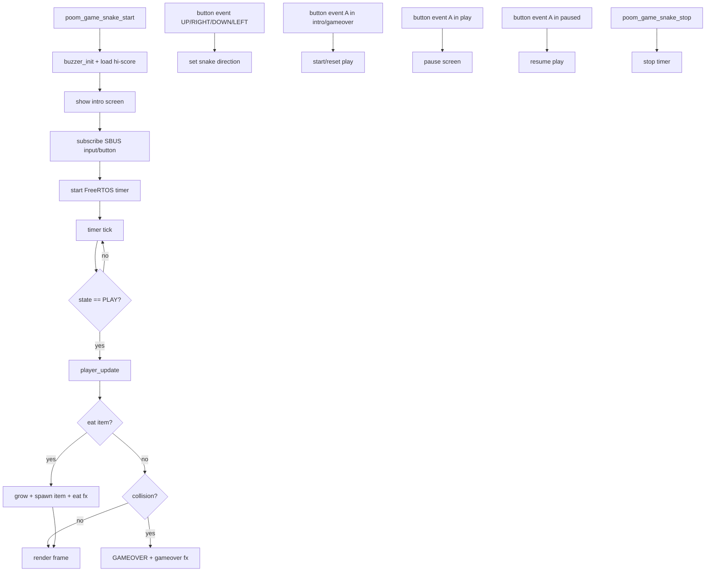

# poom_game_snake

`poom_game_snake` is a compact Snake game module for POOM devices using OLED + button events from SBUS.

## Purpose

- Render and run a Snake game loop on the OLED display.
- Receive input from `input/button` topic (`UP`, `RIGHT`, `DOWN`, `LEFT`, `A`).
- Use `A` to start, pause, and resume gameplay.
- Play sound effects with `poom_buz_theme` on eat/game-over/start.
- Keep an in-memory hi-score (stub ready for persistent storage).

## Structure

```text
applications/poom_game_snake
├── CMakeLists.txt
├── poom_game_snake.c
├── component.mk
├── include/
│   └── poom_game_snake.h
```

## Dependencies

Defined in `applications/poom_game_snake/CMakeLists.txt`:

- `sbus`
- `poom_ble_hid`
- `button_driver`
- `esp_driver_ledc`
- `poom_buz_theme`
- `buzzer`
- `oled_screen`

## Public API

Header: `applications/poom_game_snake/include/poom_game_snake.h`

```c
void poom_game_snake_start(void);
void poom_game_snake_stop(void);
void poom_game_snake_set_period_ms(uint32_t period_ms);
```

## Runtime Flow



