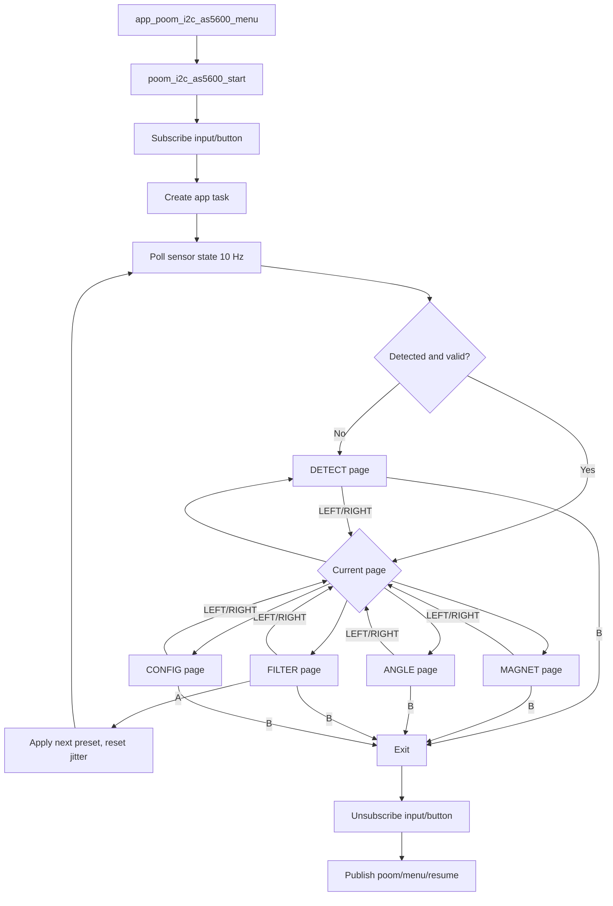

# poom_i2c_as5600

`poom_i2c_as5600` is a diagnosis app for the AS5600 contactless magnetic rotary
position sensor, connected via the QWIIC port. It walks through detection,
magnet placement, live angle readout, filter tuning, and configuration
inspection, following the launcher contract used by the other `applications`:
SBUS button input, Arduboy-style rendering, and a clean return to the menu via
`poom/menu/resume`.

## Purpose

- Verify that an AS5600 is present and responding on the shared I2C bus
  (address `0x36`).
- Diagnose magnet placement using the STATUS flags (MD/ML/MH), AGC, and
  CORDIC magnitude.
- Show the live raw angle and its conversion to degrees.
- Experiment with the filter settings (slow filter, fast filter threshold,
  hysteresis) and observe the effect on reading jitter in real time.
- Inspect the remaining configuration: power mode, watchdog, output stage,
  PWM frequency, burn count, and the programmed ZPOS/MPOS/MANG range.

The AS5600 has no chip-ID register, so identification is heuristic: the device
must ACK at `0x36` and its registers must behave like an AS5600's.

## Hardware

- AS5600 breakout on the QWIIC connector (shared I2C bus, initialized by the
  firmware at boot; the app only registers the device address).
- A **diametrically** magnetized magnet (~6 mm neodymium) placed 0.5–3 mm
  above the package center. Axially magnetized discs read as "too weak" with
  the AGC pegged at maximum.
- At 3.3 V the AGC range is 0–128; mid-range (~64) indicates a good air gap.

## Structure

- `poom_i2c_as5600.c`
  - App task, page state machine, input handling, rendering, jitter tracking,
    and launcher resume callback.
- `poom_i2c_as5600_driver.c`
  - Register-level AS5600 access on top of the shared `i2c` driver: presence
    probe, STATUS/AGC/MAGNITUDE/RAW ANGLE reads, CONF read/write (volatile),
    and ZMCO/ZPOS/MPOS/MANG reads.
- `include/poom_i2c_as5600.h`
  - Menu entry helper.
- `include/poom_i2c_as5600_driver.h`
  - Driver API, STATUS flag defines, and the decoded `as5600_conf_t` type.
- `CMakeLists.txt`
  - Component registration and dependencies.

## Usage

The app cycles through five pages with `LEFT`/`RIGHT`:

1. **DETECT** — I2C presence at `0x36` and the AS5600 validation verdict.
2. **MAGNET** — magnet state (OK / TOO WEAK / TOO STRONG / not detected),
   AGC, and magnitude. Adjust the magnet until AGC sits mid-range.
3. **ANGLE** — live raw angle (0–4095) and degrees.
4. **FILTER** — `A` cycles presets (DEFAULT, STABLE, BALANCED, FAST) that set
   SF/HYST/FTH; the JITTER line shows the observed raw-angle spread in LSB
   since the last preset change. Hold the shaft still to compare presets.
5. **CONFIG** — power mode, watchdog, output stage, PWM frequency, ZMCO burn
   count, ZPOS/MPOS/MANG, and the effective ANGLE range in degrees.

Buttons:

- `LEFT` / `RIGHT`: previous / next page.
- `A`: apply the next filter preset (FILTER page only).
- `B`: exit back to the launcher.

Notes:

- Any I2C failure or validation loss drops the app back to the DETECT page,
  so unplugging the sensor mid-session is handled gracefully.
- All configuration writes are **volatile** and revert on sensor power cycle.
  The BURN register is deliberately not exposed by the driver.

## Public API

```c
// App (include/poom_i2c_as5600.h)
void app_poom_i2c_as5600_menu(void);

// Driver (include/poom_i2c_as5600_driver.h)
void as5600_init(void);
bool as5600_detect_presence(void);
bool as5600_read_status(uint8_t *status);
bool as5600_read_agc(uint8_t *agc);
bool as5600_read_magnitude(uint16_t *magnitude);
bool as5600_read_raw_angle(uint16_t *raw_angle);
float as5600_raw_to_degrees(uint16_t raw_angle);
bool as5600_read_conf(as5600_conf_t *conf);
bool as5600_write_conf(const as5600_conf_t *conf);
bool as5600_read_zmco(uint8_t *zmco);
bool as5600_read_zpos(uint16_t *zpos);
bool as5600_read_mpos(uint16_t *mpos);
bool as5600_read_mang(uint16_t *mang);
```

## Integration

```c
#include "poom_i2c_as5600.h"

void launch_as5600(void)
{
    app_poom_i2c_as5600_menu();
}
```

`app_poom_i2c_as5600_menu()` is the launcher-oriented helper used by
`poom_menu` (listed under `THE MAKER` as `AS5600 I2C`). It starts the app and
publishes `poom/menu/resume` when the user exits.

## Runtime Behavior


