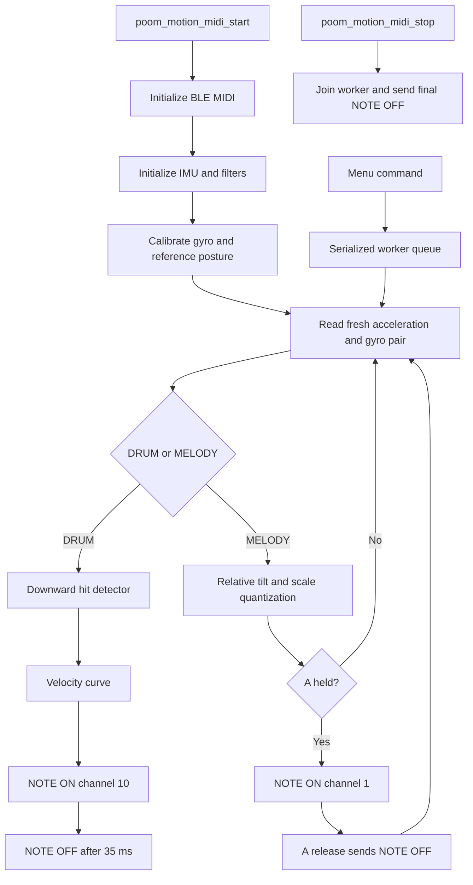

# poom_motion_midi

`poom_motion_midi` is a BLE MIDI application that turns IMU motion into drum hits and controlled melodic gestures.

The module reads acceleration and gyroscope data and sends MIDI output to the `poom-midi` BLE device. Drum mode uses **channel 10**. Melody mode uses **channel 1**. The firmware does not synthesize audio; GarageBand or another MIDI application provides the instrument and sound.

## Structure

```text
applications/poom_motion_midi
├── CMakeLists.txt
├── include/
│   └── poom_motion_midi.h
├── motion_engine.h
├── motion_engine.c
└── poom_motion_midi.c
```

## Dependencies

Declared in `applications/poom_motion_midi/CMakeLists.txt`:

* `ble_midi`
* `poom_imu_stream`
* `poom_sbus`

## Public API

Header:
`applications/poom_motion_midi/include/poom_motion_midi.h`

```c
bool poom_motion_midi_start(void);
void poom_motion_midi_stop(void);
void poom_motion_midi_get_config(poom_midi_config_t *out);
void poom_motion_midi_get_status(poom_midi_status_t *out);
void poom_motion_midi_set_config(const poom_midi_config_t *config);
void poom_motion_midi_pause(void);
void poom_motion_midi_gate(bool pressed);
void poom_motion_midi_toggle_drums(void);
void poom_motion_midi_calibrate(void);
```

## Runtime Behavior

When started, the application:

1. Initializes BLE MIDI and the LSM6DS3TR-C IMU.
2. Starts one worker task that owns sensor processing and MIDI output.
3. Publishes status updates through `poom/midi/status` for the display.
4. Processes only fresh acceleration/gyro pairs from the IMU.
5. Sends `NOTE ON` and `NOTE OFF` messages through BLE MIDI.

Commands from the menu are serialized through a queue, so navigation, calibration, and note output cannot modify the MIDI state concurrently.

## Runtime Flow

### `poom_motion_midi_start()`

* Prevents double start.
* Creates the command queue and worker task.
* Initializes BLE MIDI and the gesture-friendly IMU filter profile.
* Starts in calibration and performance output disabled.



### Motion MIDI task

The internal task runs periodically and executes one motion-processing step per iteration:

* reads only new accelerometer and gyroscope data,
* keeps the calibrated center through temporary sensor read gaps,
* sends `WAIT` status and silences output if motion data is stale for more than 150 ms,
* resumes tracking automatically when valid data returns,
* services drum note-off deadlines even when no new sensor sample arrives.

### `poom_motion_midi_stop()`

* Requests the worker to stop and waits for it to finish.
* Sends `NOTE OFF` and all-notes-off messages when needed.
* Stops BLE MIDI only after the final transport flush.
* Clears the started state before returning to the main menu.

## Button and Display Behavior

The menu keeps the existing POOM layout: `BLE: CONNECTED` or `BLE: PAIRING`, three scrolling option rows with inverted selection, and `B:BACK` in the footer.

* **UP / DOWN:** select a row.
* **LEFT / RIGHT:** change the selected value.
* **A:** performs the action shown in the footer.
* **B:** exits to ZEN from the normal screen, help screen, calibration screen, and error screen.

Navigation or a parameter change pauses output. Settings are held in RAM and are not saved across reboot.

## DRUM Mode

DRUM starts paused. Select the sound, press A to arm, and strike downward. The selected sound is sent on MIDI channel 10. Available sounds are kick, snare, closed hi-hat, open hi-hat, tom, and crash.

The detector projects linear acceleration against the calibrated gravity direction, so the upward return stroke does not trigger another hit. It uses a short 20 ms peak window, a 120 ms minimum interval, and 40 ms of quiet motion before rearming. The response curve maps hit strength to MIDI velocity 30–127.

The header shows `ARMED`, `PAUSE`, or the last strike velocity briefly. `NOTE OFF` is scheduled after 35 ms.

## MELODY Mode

Tilt selects a note without playing. Hold A to send `NOTE ON`; release A to send `NOTE OFF`.

* `FIXED` is the default and latches the selected pitch until A is released.
* `MOVING` follows tilt while A is held and changes notes with the same gate.
* Available scales are major pentatonic, minor pentatonic, major, and minor.
* Tonic, octave, and velocity intensity are configurable.

The tilt range is approximately −30 to +30 degrees around the calibrated posture. Smoothing and two-degree hysteresis prevent note chatter near boundaries. The header shows the selected pitch, or the sounding pitch with `*` while A is held. MIDI notes are clamped to 0–127.

## Calibration and Sensor Handling

Calibration runs at startup or when the `Calibrate` / `Center` row is selected. Hold the device in the posture used for playing. The progress bar requires 60 quiet samples, about 600 ms. Movement resets calibration progress.

Calibration estimates gyro bias, gravity, and the reference posture. Orientation uses gyro integration corrected by acceleration near 1 g. The lateral reference follows board Y, with board X as a fallback when Y is almost vertical.

The MIDI profile uses the IMU at 104 Hz with a faster accelerometer LPF path for short strikes and gyro high-pass disabled for orientation. Other applications retain their default filter profile. A large tilt, hit, or upward movement never requests calibration. A temporary read gap shows `WAIT`, retains the calibrated center and bias, and resumes when fresh data returns.

## MIDI Behavior

* DRUM output uses **channel 10**.
* MELODY output uses **channel 1**.
* BLE connection status is displayed separately from musical feedback.
* Disconnecting clears the gate and armed state; reconnecting never resumes a held note automatically.
* B always exits and releases active notes.

## Logging

The module uses optional `printf`-based logging controlled by these macros:

* `POOM_MOTION_MIDI_LOG_ENABLED`
* `POOM_MOTION_MIDI_DEBUG_LOG_ENABLED`

If these are not enabled through build flags or Kconfig, logging remains disabled.

## Integration

* `motion_engine.c` contains calibration, tilt quantization, hit detection, velocity mapping, hysteresis, and note state.
* `poom_motion_midi.c` owns the worker task, BLE MIDI transport, sensor reads, and serialized commands.
* `../poom_app_pack/src/menu_midi.c` renders the existing menu format and translates button events into worker commands.
* GarageBand must connect to the `poom-midi` Bluetooth MIDI device and select an instrument before musical output is heard.
