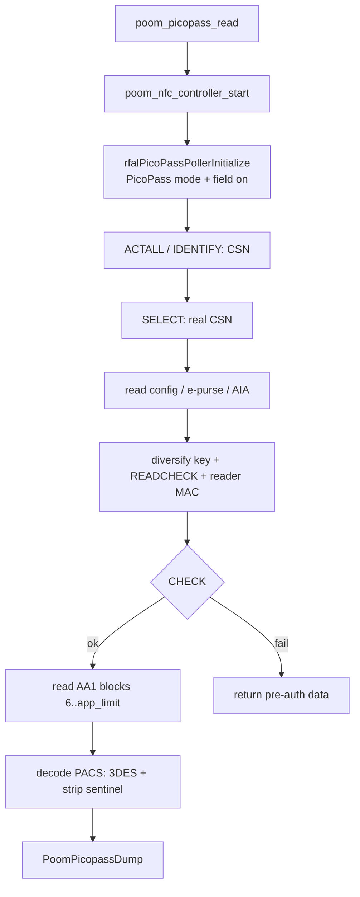

# poom_picopass

`poom_picopass` reads PicoPass / HID iCLASS cards on POOM's ST25R3916 RF
frontend. It provides:

- PicoPass anticollision and CSN read
- standard-key authentication (CSN-diversified key + reader MAC)
- authenticated read of the AA1 application area
- PACS credential extraction (3DES transport-key decrypt, bit length + raw bytes)

It reads standard-security iCLASS credentials for lab, diagnostics, and
authorized development on ESP-IDF targets, through the `nfcal` component
(RFAL/ST25R3916) hosted in `third-party/nfcal`.

## Purpose

This component contains the PicoPass-facing logic for:

- PicoPass mode setup (`RFAL_MODE_POLL_PICOPASS`, 26.48 kbit/s, manual TX CRC)
- ACTALL / IDENTIFY / SELECT / READCHECK / CHECK / READ framing and CRC
- key diversification and reader-MAC authentication (loclass)
- extracting the PACS credential from blocks 6-9 (3DES decrypt, Wiegand bit length, sentinel-stripped bytes)

## Structure

```text
applications/poom_picopass
├── include/
│   └── poom_picopass.h        # read flow + dump types (public API)
└── src/
    ├── rfal_picopass.c        # low-level poller on ST RFAL
    ├── rfal_picopass.h
    ├── poom_picopass.c        # read flow + PACS decode
    ├── poom_des.c/.h          # vendored single/3DES (Apache-2.0, from mbedTLS)
    └── loclass/               # iCLASS cipher + keygen (GPL-3.0, from Proxmark3)
        └── optimized_*.c/.h
```

The device-menu entry lives with the other menus in
`applications/poom_app_pack/src/menu_picopass.c`.

## Integration

Registered by `applications/poom_picopass/CMakeLists.txt`, which requires:

- `nfcal` - RFAL/ST25R3916 platform integration from `third-party/nfcal`
- `poom_nfc` - NFC core bring-up (`poom_nfc_controller_start`)

The menu is wired into the UI via `poom_app_pack` (`menu_picopass.c`) and
`poom_menu` (the **PICOPASS** entry under **THE ZEN**). DES/3DES are vendored
(`poom_des.c`) because ESP-IDF 6.1's mbedTLS dropped `MBEDTLS_DES_C`.

> **License:** the `loclass/` files are GPL-3.0-or-later. Linking this app makes
> the resulting firmware image GPL-3.0; the rest of `poom_picopass` is otherwise
> self-contained (`poom_des.c` is Apache-2.0).

## Public API

- `PoomPicopassStatus poom_picopass_read(PoomPicopassDump* out)`
  - reads a card into `out`, trying known keys until one authenticates: the
    standard debit key and standard dictionary, then the elite dictionary and
    the VB6 LCG elite keygen
- `int poom_picopass_format(const PoomPicopassDump* dump, char* buf, int buf_len)`
  - renders a dump as human-readable hex lines
- `const uint8_t poom_picopass_standard_key[8]`
  - the well-known standard iCLASS debit key
- `void menu_picopass_show(void)` (in `poom_app_pack`)
  - opens the device-menu submenu

## Runtime Flow


