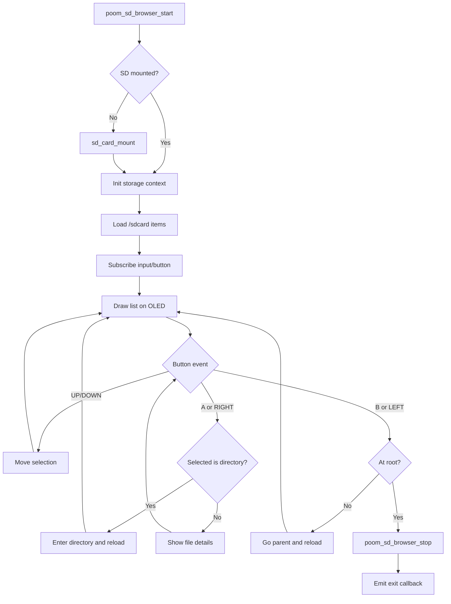

# poom_sd_browser

`poom_sd_browser` is an SD card browser application for OLED-based devices.
It provides a simple file navigation UI controlled by hardware buttons.

## Features

- SD card mount check and runtime startup.
- Directory listing from `/sdcard` root.
- Folder navigation (enter folder / go parent).
- File details view (name and size in bytes).
- OLED rendering with selection highlight.
- Button-driven controls through `sbus` (`input/button`).

## Structure

The module is split into two C files:

- `poom_sd_browser_storage.c`
  - Pure storage/navigation logic for SD filesystem entries.
  - No OLED and no button handling.
- `poom_sd_browser.c`
  - UI and interaction layer (OLED + buttons).
  - Calls storage layer functions.

## Controls

- `UP`: move selection up.
- `DOWN`: move selection down.
- `A` or `RIGHT`: open selected item.
- `B` or `LEFT`: back.

Behavior:

- If selected item is a folder, browser enters that folder.
- If selected item is a file, browser shows file details.
- At SD root, pressing back exits browser and triggers optional exit callback.

## Public API

```c
esp_err_t poom_sd_browser_start(void);
esp_err_t poom_sd_browser_stop(void);
bool poom_sd_browser_is_running(void);
esp_err_t poom_sd_browser_set_exit_callback(poom_sd_browser_exit_cb_t callback, void* user_ctx);
```

## Usage

```c
#include "poom_sd_browser.h"

static void on_sd_browser_exit(void* user_ctx) {
    (void)user_ctx;
    // Return to menu or restore previous app state.
}

void start_sd_browser(void) {
    (void)poom_sd_browser_set_exit_callback(on_sd_browser_exit, NULL);
    (void)poom_sd_browser_start();
}
```

## Runtime Flow


