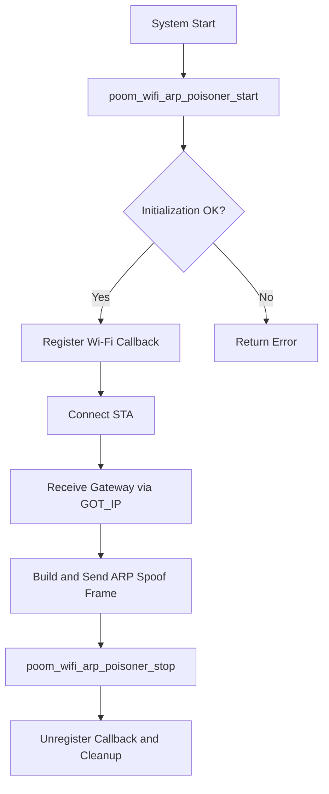

# poom_wifi_arp_poisoner

## Purpose

`poom_wifi_arp_poisoner` demonstrates controlled ARP spoof frame generation after STA connection and gateway acquisition.

## Responsibilities

- Initialize Wi-Fi connection callbacks via `poom_wifi_ctrl`.
- Capture gateway IP from STA event data.
- Build and transmit one forged ARP reply frame.
- Expose runtime start/stop/status API.

## Features

- POOM Wi-Fi callback integration.
- Raw 802.11 TX for crafted ARP payload.
- Basic LED status indication using WS2812.
- Automatic reconnect attempt on disconnection.

## Public API

Header: `applications/poom_wifi_arp_poisoner/include/poom_wifi_arp_poisoner.h`

- `esp_err_t poom_wifi_arp_poisoner_start(void)`
- `esp_err_t poom_wifi_arp_poisoner_stop(void)`
- `bool poom_wifi_arp_poisoner_is_initialized(void)`

## Structure

```text
applications/poom_wifi_arp_poisoner
├── CMakeLists.txt
├── component.mk
├── README.md
├── include/
│   └── poom_wifi_arp_poisoner.h
└── poom_wifi_arp_poisoner.c
```

## Integration Notes

- Add `poom_wifi_arp_poisoner` in `REQUIRES` where needed.
- Depends on `poom_wifi_ctrl`, `esp_wifi`, `ws2812`, and `board`.
- Use only in legal lab/testing setups.

## Configuration Options

- `CONFIG_POOM_WIFI_ARP_POISONER_ENABLE_LOG`
  Enables POOM log macros in this module.

## Logging

- Uses POOM log format with tag `poom_wifi_arp_poisoner`.
- Connection, disconnection, and frame TX status are logged.

## Usage

```c
#include "poom_wifi_arp_poisoner.h"

void run_arp_lab(void)
{
    (void)poom_wifi_arp_poisoner_start();
}
```

## Runtime Flow


