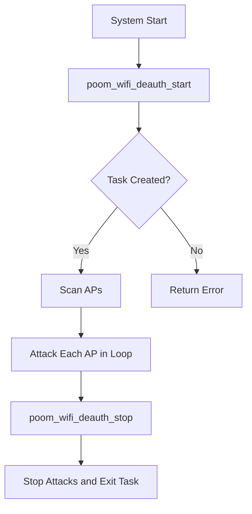

# poom_wifi_deauth

## Purpose

`poom_wifi_deauth` provides scan-and-attack helpers for Wi-Fi deauthentication test scenarios.

## Responsibilities

- Run AP scans through `poom_wifi_scanner`.
- Print target AP inventory.
- Launch single-target deauth operations.
- Run continuous scan + deauth attack loop.

## Features

- One-shot AP scan listing.
- One-shot deauth by index.
- Continuous loop mode for repeated test cycles.
- Runtime stop control.

## Public API

Header: `applications/poom_wifi_deauth/include/poom_wifi_deauth.h`

- `esp_err_t poom_wifi_deauth_scan_and_list(void)`
- `esp_err_t poom_wifi_deauth_attack(int index)`
- `esp_err_t poom_wifi_deauth_start(void)`
- `esp_err_t poom_wifi_deauth_stop(void)`
- `bool poom_wifi_deauth_is_running(void)`

## Structure

```text
applications/poom_wifi_deauth
├── CMakeLists.txt
├── component.mk
├── README.md
├── include/
│   └── poom_wifi_deauth.h
└── poom_wifi_deauth.c
```

## Integration Notes

- Add `poom_wifi_deauth` in `REQUIRES` where this API is used.
- Depends on `poom_wifi_attacks` and `poom_wifi_scanner`.
- Intended for controlled lab/testing environments.

## Configuration Options

- `CONFIG_POOM_WIFI_DEAUTH_ENABLE_LOG`
  Enables POOM log macros in this module.

## Logging

- Uses POOM log format with tag `poom_wifi_deauth`.
- Attack and scan status are printed to console.

## Usage

```c
#include "poom_wifi_deauth.h"

void run_test(void)
{
    (void)poom_wifi_deauth_scan_and_list();
    (void)poom_wifi_deauth_start();
}
```

## Runtime Flow


