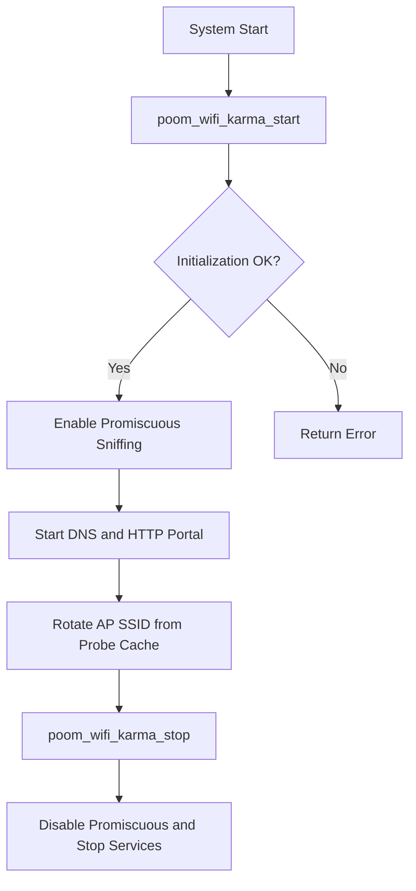

# poom_wifi_karma

## Purpose

`poom_wifi_karma` runs a lightweight Karma-style Wi-Fi impersonation workflow:

- Sniffs probe requests in promiscuous mode.
- Caches discovered SSIDs.
- Rotates AP spoofing using captured SSIDs.
- Serves a captive portal with HTTP + DNS redirection.

## Responsibilities

- Manage Karma runtime start/stop.
- Maintain SSID cache from probe traffic.
- Rotate fake AP identity periodically.
- Expose discovered SSIDs to other modules.

## Runtime Behavior

- Promiscuous probe sniffing via `poom_wifi_ctrl`.
- AP rotation every fixed interval.
- Embedded DNS redirect responder.
- Embedded captive portal HTTP server.

## Public API

Header: `applications/poom_wifi_karma/include/poom_wifi_karma.h`

- `esp_err_t poom_wifi_karma_start(void)`
- `esp_err_t poom_wifi_karma_stop(void)`
- `int poom_wifi_karma_get_discovered_ssids(char destination_array[][33], int max_count)`

## Structure

```text
applications/poom_wifi_karma
├── CMakeLists.txt
├── component.mk
├── README.md
├── include/
│   └── poom_wifi_karma.h
└── poom_wifi_karma.c
```

## Integration

- Add `poom_wifi_karma` to app `REQUIRES` when calling its API.
- Requires `poom_wifi_ctrl`, `esp_http_server`, and `esp_timer`.
- Designed for AP+STA runtime managed by `poom_wifi_ctrl`.

## Usage

- `CONFIG_POOM_WIFI_KARMA_ENABLE_LOG`
  Enables POOM log macros in this module.

## Runtime Behavior

- Uses POOM log format with tag `poom_wifi_karma`.
- Error, warning, info, and debug levels are available via local macros.

## Usage Example

```c
#include "poom_wifi_karma.h"

void app_main(void)
{
    if(poom_wifi_karma_start() == ESP_OK)
    {
        // Runtime active
    }
}
```

## Runtime Flow


