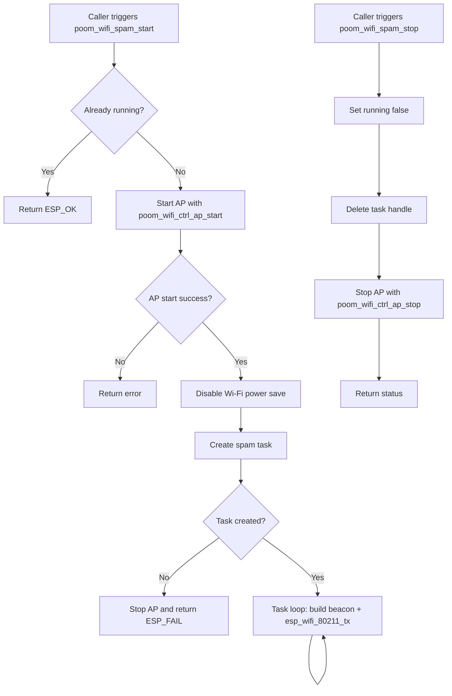

# poom_wifi_spam

`poom_wifi_spam` transmits rotating spoofed 802.11 beacon frames using a controlled AP runtime.

## Purpose

- Initialize AP mode through `poom_wifi_ctrl`.
- Build and transmit raw beacon frames with rotating SSIDs.
- Provide a small API for start, stop, and runtime state checks.

## Structure

```text
applications/poom_wifi_spam
├── CMakeLists.txt
├── component.mk
├── README.md
├── include/
│   └── poom_wifi_spam.h
└── poom_wifi_spam.c
```

## Dependencies

Defined in `applications/poom_wifi_spam/CMakeLists.txt`:

- `poom_wifi_ctrl`
- `esp_wifi`

## Public API

Header: `applications/poom_wifi_spam/include/poom_wifi_spam.h`

```c
esp_err_t poom_wifi_spam_start(void);
esp_err_t poom_wifi_spam_stop(void);
esp_err_t poom_wifi_spam_get_running(bool *out_running);
```

## Runtime Behavior

1. `poom_wifi_spam_start()` validates state and starts AP mode.
2. AP mode is configured and power save is disabled.
3. A FreeRTOS task continuously builds and transmits beacons.
4. `poom_wifi_spam_stop()` stops transmission and tears down AP mode.
5. `poom_wifi_spam_get_running()` reports current runtime status.

## Runtime Flow



## Notes

- SSID values are capped to 32 bytes to match IEEE 802.11 limits.
- Beacon template, sequence handling, and SSID rotation are implemented in `poom_wifi_spam.c`.
