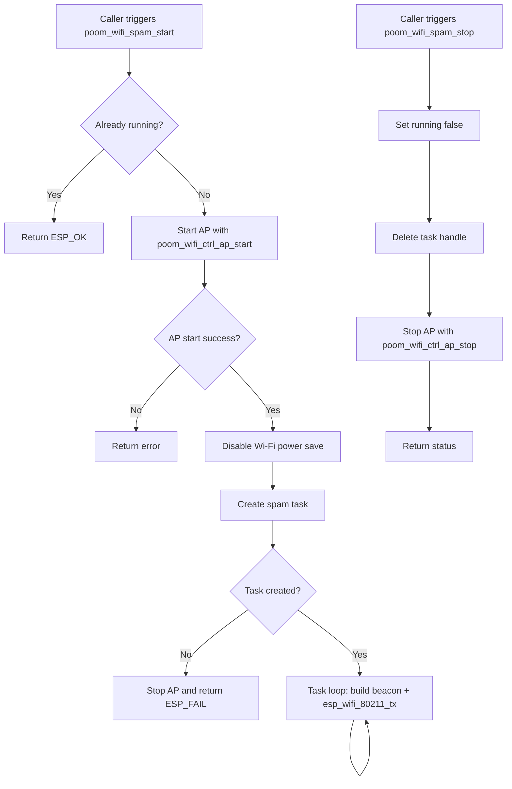

# poom_wifi_spam

`poom_wifi_spam` transmits rotating spoofed 802.11 beacon frames using a controlled AP runtime.

## Purpose

- Initialize AP mode through `poom_wifi_ctrl`.
- Build and transmit raw beacon frames with rotating SSIDs.
- Provide a small API for start, stop, and runtime state checks.

## Structure

```text
applications/poom_wifi_spam
├── CMakeLists.txt
├── component.mk
├── README.md
├── include/
│   └── poom_wifi_spam.h
└── poom_wifi_spam.c
```

## Dependencies

Defined in `applications/poom_wifi_spam/CMakeLists.txt`:

- `poom_wifi_ctrl`
- `esp_wifi`
- `poom_secrets_store` (persist SSID list)

## Public API

Header: `applications/poom_wifi_spam/include/poom_wifi_spam.h`

```c
esp_err_t poom_wifi_spam_start(void);
esp_err_t poom_wifi_spam_stop(void);
esp_err_t poom_wifi_spam_get_running(bool *out_running);

esp_err_t poom_wifi_spam_ssids_get(poom_wifi_spam_ssid_list_t* out_list);
esp_err_t poom_wifi_spam_ssids_set(const poom_wifi_spam_ssid_list_t* list);
esp_err_t poom_wifi_spam_ssids_remove(uint8_t index);
esp_err_t poom_wifi_spam_ssids_add(const char* ssid);
esp_err_t poom_wifi_spam_ssids_reset_defaults(void);
```

## Runtime Behavior

1. `poom_wifi_spam_start()` validates state and starts AP mode.
2. AP mode is configured and power save is disabled.
3. A FreeRTOS task continuously builds and transmits beacons.
4. `poom_wifi_spam_stop()` stops transmission and tears down AP mode.
5. `poom_wifi_spam_get_running()` reports current runtime status.

## Integration


```mermaid
flowchart TD
    A[Caller triggers poom_wifi_spam_start] --> B{Already running?}
    B -->|Yes| C[Return ESP_OK]
    B -->|No| D[Start AP with poom_wifi_ctrl_ap_start]
    D --> E{AP start success?}
    E -->|No| F[Return error]
    E -->|Yes| G[Disable Wi-Fi power save]
    G --> H[Create spam task]
    H --> I{Task created?}
    I -->|No| J[Stop AP and return ESP_FAIL]
    I -->|Yes| K[Task loop: build beacon + esp_wifi_80211_tx]
    K --> K
    L[Caller triggers poom_wifi_spam_stop] --> M[Set running false]
    M --> N[Delete task handle]
    N --> O[Stop AP with poom_wifi_ctrl_ap_stop]
    O --> P[Return status]
```

## Usage

The `poom_cli` component registers these helpers:

- `wifi-spam-ssids-show`
- `wifi-spam-ssids-set <ssid1> [ssid2] ...`
- `wifi-spam-ssids-add <ssid>`
- `wifi-spam-ssids-del <index>`
- `wifi-spam-ssids-reset`
