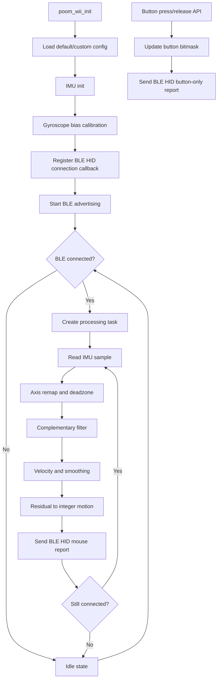

# poom_wii

`poom_wii` is an embedded BLE HID air-mouse module for ESP-IDF devices.
It combines IMU data (accelerometer + gyroscope) with a complementary filter and reports pointer movement over BLE HID.

## Purpose

- BLE HID mouse movement from IMU orientation and angular rate
- Runtime smoothing and deadzone control
- Gyroscope bias calibration at startup
- Left/right mouse button press-hold-release support
- BLE connection callback hook for UI updates

## Structure

- `poom_wii.c`: implementation (no `src/` folder)
- `include/poom_wii.h`: public API
- `CMakeLists.txt`: component definition

## Runtime Behavior

## Public API

- Initialization:
  - `poom_wii_init`
  - `poom_wii_init_with_config`
  - `poom_wii_get_default_config`
- Runtime control:
  - `poom_wii_start`
  - `poom_wii_stop`
  - `poom_wii_is_running`
  - `poom_wii_is_connected`
  - `poom_wii_set_connection_handler`
- Mouse buttons:
  - `poom_wii_left_button_press`
  - `poom_wii_left_button_release`
  - `poom_wii_right_button_press`
  - `poom_wii_right_button_release`

## Integration

- Add `poom_wii` to the consumer component `REQUIRES` list.
- Call `poom_wii_init()` once when entering the app/module.
- Call `poom_wii_start()` to enable processing.
- Use the button APIs for hold-click behavior from your input layer.
- Register `poom_wii_set_connection_handler()` if your UI must redraw on connect/disconnect.

## Tuning

Use `poom_wii_config_t` to tune:

- `complementary_alpha`
- `smooth_beta`
- `gyro_deadzone_dps`
- `gain_x`, `gain_y`
- `tilt_gain_x`, `tilt_gain_y`
- `task_period_ms`
- calibration sample count/delay
