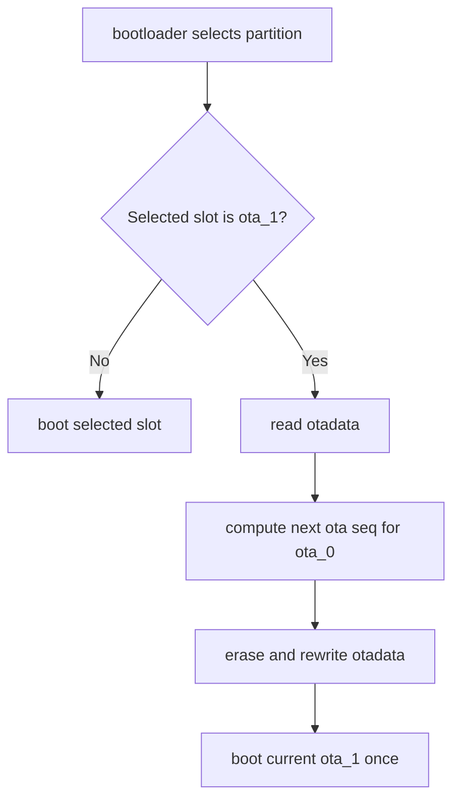

# poom_boot_policy bootloader hook

This bootloader-side POOM component adds the one-shot return behavior for external games.

If the selected boot target is `ota_1`, the hook lets that boot proceed once and rewrites `otadata` so the following power cycle returns to `ota_0`.

## Purpose

- Intercept the bootloader partition selection step.
- Detect when `ota_1` was selected as the current boot target.
- Re-arm `ota_0` as the next boot target before launching the game image.
- Keep the base POOM image as the default system entry point after a reset or power cycle.

## Structure

```text
bootloader_components/poom_boot_policy/
├── CMakeLists.txt
├── README.md
└── hooks.c
```

## Implementation

The component wraps:

- `bootloader_utility_get_selected_boot_partition()`

and uses internal bootloader helpers to:

- read `otadata`,
- compute the next OTA sequence,
- erase the selected OTA metadata sector,
- write the updated entry back to flash.

## Runtime Behavior

1. The normal bootloader chooses a boot partition.
2. The wrapper checks whether the chosen slot is `ota_1`.
3. If not, boot continues unchanged.
4. If yes, the wrapper updates `otadata` so the next boot points to `ota_0`.
5. The current boot still continues into `ota_1`.

## Runtime Flow


