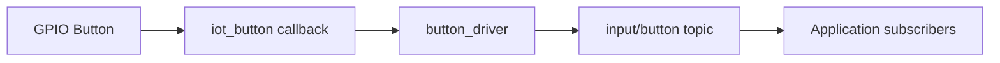

# button_driver

`button_driver` initializes board buttons using `espressif/button` and publishes events to SBUS.

## Structure

```text
drivers/button_driver
├── CMakeLists.txt
├── component.mk
├── include/
│   ├── button_driver.h
│   └── input_events.h
└── button_driver.c
```

## Dependencies

- `button`
- `esp_timer`
- `sbus`
- `board`

## Public API

- `button_module_begin(void)`
- `button_module_reset_idle_timer(void)`
- `button_module_set_lock(bool lock)`

## Usage

```c
#include "button_driver.h"

void app_main(void)
{
    button_module_begin();
    button_module_set_lock(false);
}
```

## Runtime Flow


