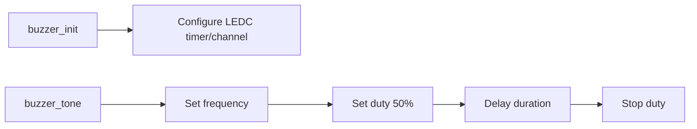

# buzzer

`buzzer` is a simple PWM buzzer driver built on top of ESP-IDF LEDC.

## Structure

```text
drivers/buzzer
├── CMakeLists.txt
├── component.mk
├── include/
│   └── buzzer.h
└── buzzer.c
```

## Dependencies

- `driver`
- `esp_driver_gpio`
- `esp_driver_ledc`

## Public API

- `buzzer_init(uint8_t pin)`
- `buzzer_tone(uint32_t freq_hz, uint32_t duration_ms)`

## Usage

```c
#include "buzzer.h"

void app_main(void)
{
    buzzer_init(10);
    buzzer_tone(2000, 120);
}
```

## Runtime Flow


