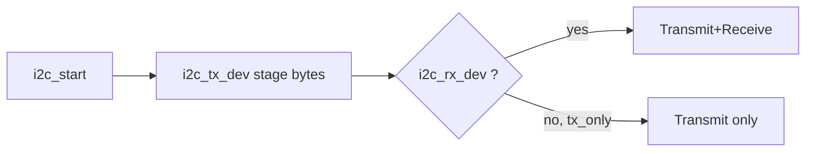

# i2c

`i2c` is a shared I2C bus layer that supports multi-device registration and staged TX/TX+RX transactions.

## Structure

```text
drivers/i2c
├── CMakeLists.txt
├── component.mk
├── include/
│   └── i2c.h
└── i2c.c
```

## Dependencies

- `driver`
- `esp_driver_i2c`
- `board`

## Public API

- `i2c_init`
- `i2c_register_device`
- `i2c_start`
- `i2c_tx_dev`
- `i2c_rx_dev`
- `i2c_rx_only`
- `i2c_scan_devices`
- `i2c_lock`
- `i2c_unlock`

## Usage

```c
#include "i2c.h"

void app_main(void)
{
    (void)i2c_init();
    (void)i2c_register_device(0x3C);
}
```

## Runtime Flow


