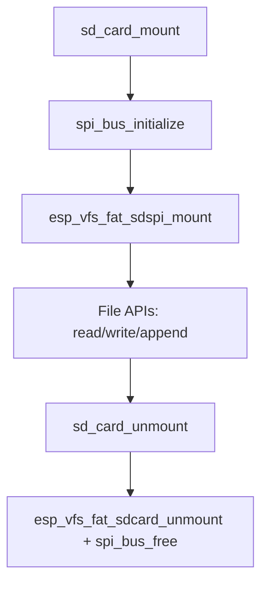

# sd_card

`sd_card` provides SD-over-SPI mount/unmount and file utility operations through FATFS + VFS.

## Structure

```text
drivers/sd_card
├── CMakeLists.txt
├── component.mk
├── include/
│   └── sd_card.h
└── sd_card.c
```

## Dependencies

- `nvs_flash`
- `console`
- `fatfs`
- `board`

## Public API

- `sd_card_begin`
- `sd_card_mount`
- `sd_card_unmount`
- `sd_card_check_format`
- `sd_card_format`
- `sd_card_create_dir`
- `sd_card_create_file`
- `sd_card_read_file`
- `sd_card_write_file`
- `sd_card_append_to_file`
- `sd_card_read_file_to_buffer`
- `sd_card_get_info`

## Usage

```c
#include "sd_card.h"

void app_main(void)
{
    sd_card_begin();
    if (sd_card_mount() == ESP_OK) {
        (void)sd_card_write_file("log.txt", "hello\n");
        (void)sd_card_unmount();
    }
}
```

## Runtime Flow


