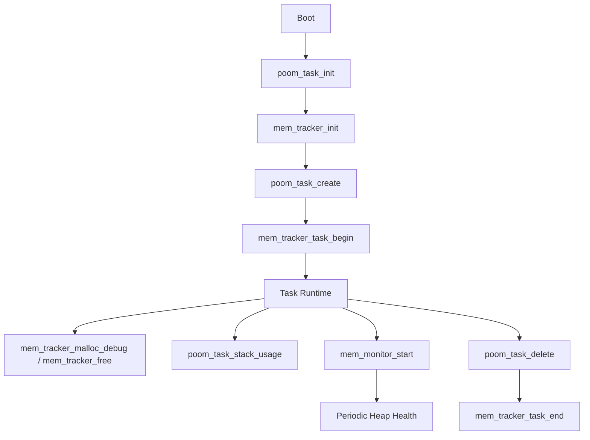

# POOM Kernel

## Overview
The `kernel` folder provides internal runtime services used by POOM firmware modules:

- `memory`: heap monitoring and per-task dynamic memory tracking.
- `task`: task registry, lifecycle helpers, and stack usage reporting.

These modules are designed for auditability, so memory and task behavior can be exposed later in Settings screens.

## Modules

### `memory`
Implements two subsystems:

- `memory_monitor`
  - Periodic heap health monitor.
  - Severity levels: `HEALTHY`, `WARNING`, `CRITICAL`, `EMERGENCY`.
  - Runtime thresholds and callback support.

- `memory_tracker`
  - Tracks allocations by task owner.
  - Provides global and per-task stats.
  - Supports cleanup of leaked allocations on task end.

Public headers:
- `kernel/memory/include/memory_monitor.h`
- `kernel/memory/include/memory_tracker.h`

### `task`
Provides task lifecycle wrappers and runtime diagnostics:

- `poom_task_create` registers tasks and starts tracking.
- `poom_task_delete` removes task, closes tracker context, and optionally frees pending tracked memory.
- Stack and active-task reporting helpers.

Public header:
- `kernel/task/include/task.h`

## Runtime Flow



## Basic Integration

```c
#include "task.h"
#include "memory_tracker.h"
#include "memory_monitor.h"

static void worker_task(void *arg)
{
    (void)arg;

    void *buf = MEM_TRACKER_MALLOC(512);
    // ... use buffer
    mem_tracker_free(buf);

    poom_task_delete(NULL); // delete current task
}

void kernel_services_start(void)
{
    TaskHandle_t handle = NULL;

    poom_task_init();
    mem_monitor_init();
    mem_monitor_start(1000);

    poom_task_create(worker_task, "worker", 2048, NULL, 5, &handle);
}
```

## Logging

`memory_monitor`, `memory_tracker`, and `task` use POOM log macros (`POOM_PRINTF_*`) with tags:

- `poom_memory_monitor`
- `poom_memory_tracker`
- `poom_task`

## Notes

- This kernel layer tracks only allocations made through `mem_tracker_malloc_debug` (or `MEM_TRACKER_MALLOC`).
- If a task allocates memory with plain `malloc`, it will not appear in tracker reports.
- For full audit visibility, prefer tracker wrappers in task-owned dynamic allocations.
