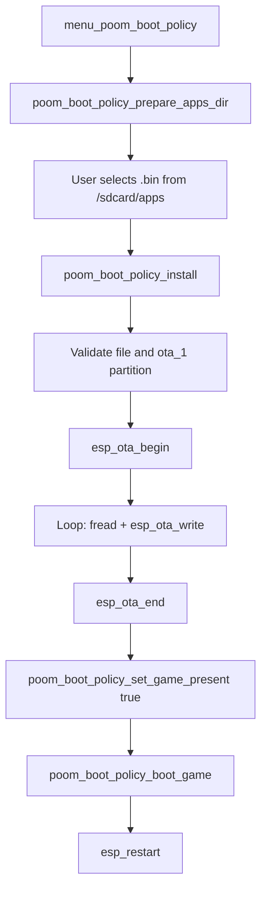

# poom_boot_policy

`poom_boot_policy` is the POOM module that manages the external-game boot flow.

It keeps the base project in `ota_0`, installs external game binaries into `ota_1`, and exposes helpers to switch the next boot target when the UI requests it.

## Purpose

- Keep the base POOM image as the default normal boot target.
- Detect whether a valid game image exists in `ota_1`.
- Stream a `.bin` file from the SD card into `ota_1`.
- Mark the next boot target as either the base app or the installed game.
- Prepare `/sdcard/apps` for the game browser flow.

## Structure

```text
modules/poom_boot_policy/
├── CMakeLists.txt
├── README.md
├── include/
│   └── poom_boot_policy.h
└── poom_boot_policy.c
```

## Public API

Header:
`modules/poom_boot_policy/include/poom_boot_policy.h`

```c
typedef enum
{
    POOM_BOOT_TARGET_POOM = 0,
    POOM_BOOT_TARGET_GAME = 1,
} poom_boot_target_t;

esp_err_t poom_boot_policy_init(void);
esp_err_t poom_boot_policy_apply_startup_policy(void);
poom_boot_target_t poom_boot_policy_get_preference(void);
esp_err_t poom_boot_policy_set_preference(poom_boot_target_t target);
bool poom_boot_policy_game_present(void);
esp_err_t poom_boot_policy_set_game_present(bool present);
esp_err_t poom_boot_policy_prepare_apps_dir(void);
esp_err_t poom_boot_policy_install(const char* path);
esp_err_t poom_boot_policy_install_and_boot(const char* path);
esp_err_t poom_boot_policy_boot_poom(void);
esp_err_t poom_boot_policy_boot_game(void);
esp_err_t poom_return_to_base(void);
```

## Runtime Behavior

When used by the app layer, the module:

1. initializes persistent state through `poom_secrets_store`,
2. checks whether `ota_1` contains a valid application image,
3. mounts the SD card if needed and ensures `/sdcard/apps` exists,
4. validates the selected `.bin` file,
5. streams the file into `ota_1` using `esp_ota_begin`, `esp_ota_write`, and `esp_ota_end`,
6. marks the game as present,
7. selects the next boot target when requested.

## Runtime Flow

