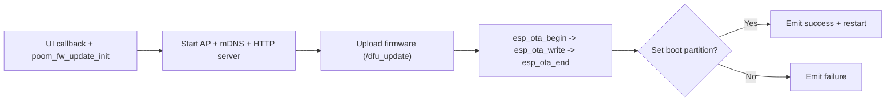

# poom_fw_update

`DFU` is the firmware update component for POOM devices on ESP-IDF.

It provides OTA update over HTTP, running in AP mode through `poom_wifi_ctrl`,
with a small public API (`poom_fw_update_*`) and UI event callbacks.

---

## Reference Origin

This DFU flow is based on the OTA web-update approach from:

`https://github.com/xpress-embedo/ESP32/tree/master`

The current implementation in this repository has been adapted to POOM
architecture and naming conventions.

---

## Current Architecture

`components/poom_fw_update` is split in:

- `poom_fw_update.c`: public firmware-update API and startup flow
- `modules/http_server/http_server.c`: embedded web server + OTA handlers
- `include/dfu.h`: public API/event definitions
- `include/poom_dfu_log.h`: logging macros (`POOM_DFU_PRINTF_*`)
- `src/webpage/*`: embedded web assets (HTML/CSS/JS)

Wi-Fi/AP management is done through `poom_wifi_ctrl` (not through legacy `wifi_ap`).

---

## Runtime Flow

---

## Features

- Start DFU in AP mode using `poom_wifi_ctrl`
- Serve embedded OTA webpage
- Receive firmware binary via `/dfu_update`
- Write OTA image with `esp_ota_*`
- Set next boot partition on success
- Expose OTA status through `/ota_status`
- Emit DFU events for UI integration:
  - `POOM_FW_UPDATE_SHOW_START_EVENT`
  - `POOM_FW_UPDATE_SHOW_PROGRESS_EVENT`
  - `POOM_FW_UPDATE_SHOW_RESULT_EVENT`

---

## Public API

Declared in `components/poom_fw_update/include/dfu.h`:

- `esp_err_t poom_fw_update_init(void);`
- `esp_err_t poom_fw_update_set_show_event_cb(poom_fw_update_show_event_cb_t cb);`
- `void poom_fw_update_emit_event(uint8_t event, void* context);`
- `const char* poom_fw_update_get_wifi_ap_ssid(void);`
- `const char* poom_fw_update_get_wifi_ap_password(void);`

---

## Logging

DFU uses `POOM_DFU_PRINTF_E/W/I/D` from:

- `components/poom_fw_update/include/poom_dfu_log.h`

Log output is controlled by:

- `CONFIG_POOM_WIFI_CTRL_ENABLE_LOG`

---

## Integration Notes

- DFU depends on:
  - `poom_wifi_ctrl`
  - `esp_http_server`
  - `app_update`
  - `esp_timer`
  - `mdns_manager`
- `http_server_start()` returns `esp_err_t` and should be checked.
- UI modules should register callback via `poom_fw_update_set_show_event_cb(...)`.

---

## Security Notes

- AP credentials are configured via `poom_wifi_ctrl` Kconfig.
- OTA endpoint is local to AP mode; still, do not use weak credentials.
- Keep `max_connection` low for maintenance/update scenarios.

---

## Suggested Flow

1. Call `poom_fw_update_set_show_event_cb(...)`
2. Call `poom_fw_update_init()`
3. User connects to AP credentials from `poom_fw_update_get_wifi_ap_*`
4. Open DFU web page and upload firmware
5. Handle result event in UI
