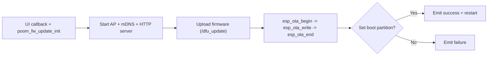

# poom_fw_update

`poom_fw_update` is the POOM firmware-update module for ESP-IDF devices.

It provides OTA update over HTTP, runs the update flow in AP mode through `poom_wifi_ctrl`, and exposes a small public API plus UI event callbacks.

## Structure

```text
modules/poom_fw_update
├── CMakeLists.txt
├── README.md
├── poom_fw_update.c
├── include/
│   ├── dfu.h
│   └── poom_dfu_log.h
├── modules/http_server/
│   ├── http_server.c
│   └── http_server.h
└── src/webpage/
    ├── index.html
    ├── app.css
    ├── app.js
    └── jquery-3.3.1.min.js
```

## Public API

Header:
`modules/poom_fw_update/include/dfu.h`

```c
esp_err_t poom_fw_update_init(void);
esp_err_t poom_fw_update_set_show_event_cb(poom_fw_update_show_event_cb_t cb);
void poom_fw_update_emit_event(uint8_t event, void* context);
const char* poom_fw_update_get_wifi_ap_ssid(void);
const char* poom_fw_update_get_wifi_ap_password(void);
```

## Runtime Behavior

When started, the module:

1. brings up a management AP through `poom_wifi_ctrl`,
2. starts the embedded HTTP server,
3. serves the OTA web page,
4. receives the uploaded firmware image,
5. writes it with `esp_ota_*`,
6. selects the next boot partition on success.

## Runtime Flow


```mermaid
flowchart LR
    A["UI callback + poom_fw_update_init"] --> B["Start AP + mDNS + HTTP server"]
    B --> C["Upload firmware (/dfu_update)"]
    C --> D["esp_ota_begin -> esp_ota_write -> esp_ota_end"]
    D --> E{"Set boot partition?"}
    E -- Yes --> F["Emit success + restart"]
    E -- No --> G["Emit failure"]
```

## Logging

Logging macros are defined in:

* `modules/poom_fw_update/include/poom_dfu_log.h`

The module uses the `POOM_DFU_PRINTF_E/W/I/D` family for runtime diagnostics.

## Integration

* Wi-Fi/AP management is delegated to `poom_wifi_ctrl`.
* The OTA web assets are embedded from `src/webpage/`.
* The implementation was adapted to POOM conventions from an earlier ESP32 OTA web-update flow, but the current structure and naming are POOM-native.

Log output is controlled by:

- `CONFIG_POOM_WIFI_CTRL_ENABLE_LOG`

---

## Integration Notes

- DFU depends on:
  - `poom_wifi_ctrl`
  - `esp_http_server`
  - `app_update`
  - `esp_timer`
  - `mdns_manager`
- `http_server_start()` returns `esp_err_t` and should be checked.
- UI modules should register callback via `poom_fw_update_set_show_event_cb(...)`.

---

## Security Notes

- AP credentials are configured via `poom_wifi_ctrl` Kconfig.
- OTA endpoint is local to AP mode; still, do not use weak credentials.
- Keep `max_connection` low for maintenance/update scenarios.

---

## Suggested Flow

1. Call `poom_fw_update_set_show_event_cb(...)`
2. Call `poom_fw_update_init()`
3. User connects to AP credentials from `poom_fw_update_get_wifi_ap_*`
4. Open DFU web page and upload firmware
5. Handle result event in UI
