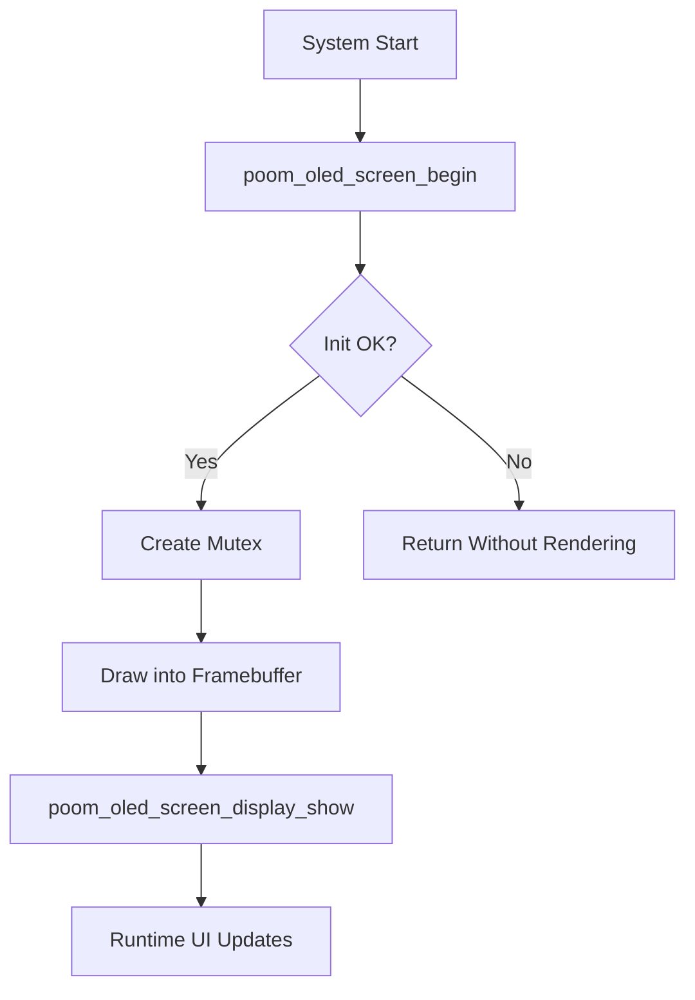

# poom_oled_screen

## Purpose
`poom_oled_screen` provides a thread-safe high-level OLED UI wrapper on top of `oled_driver`.

## Responsibilities
- Initialize the OLED screen with project display configuration.
- Expose drawing helpers for text, bitmaps, and primitives.
- Protect shared framebuffer operations with a mutex.

## Features
- Centered and aligned text rendering.
- Bitmap and mixed bitmap+text rendering.
- Primitive drawing: line, rect, rounded rect, box, pixel.
- Buffer snapshot/restore helpers.
- Loading bar helper.

## Public API
- `poom_oled_screen_begin`
- `poom_oled_screen_clear`
- `poom_oled_screen_clear_buffer`
- `poom_oled_screen_display_show`
- `poom_oled_screen_display_text`
- `poom_oled_screen_display_text_center`
- `poom_oled_screen_display_bitmap`
- `poom_oled_screen_draw_*`

See [include/poom_oled_screen.h](include/poom_oled_screen.h) for the full API.

## Structure
- `poom_oled_screen.c`: module implementation.
- `include/poom_oled_screen.h`: public API and constants.
- `CMakeLists.txt`: ESP-IDF component registration.

## Integration Notes
- Requires `oled` and `driver` components.
- Call `poom_oled_screen_begin()` once before drawing operations.
- This module assumes an SSD1306-style page framebuffer through `oled_driver`.

## Configuration Options
- `CONFIG_RESOLUTION_128X64` / `CONFIG_RESOLUTION_128X32`
- `CONFIG_FLIP`

## Logging
This module does not emit runtime logs by default.

## Usage
```c
poom_oled_screen_begin();
poom_oled_screen_clear_buffer();
poom_oled_screen_display_text_center("HELLO", 0, OLED_DISPLAY_NORMAL);
poom_oled_screen_draw_rect_round(0, 10, 128, 52, 4, OLED_DISPLAY_NORMAL);
poom_oled_screen_display_show();
```

## Runtime Flow

