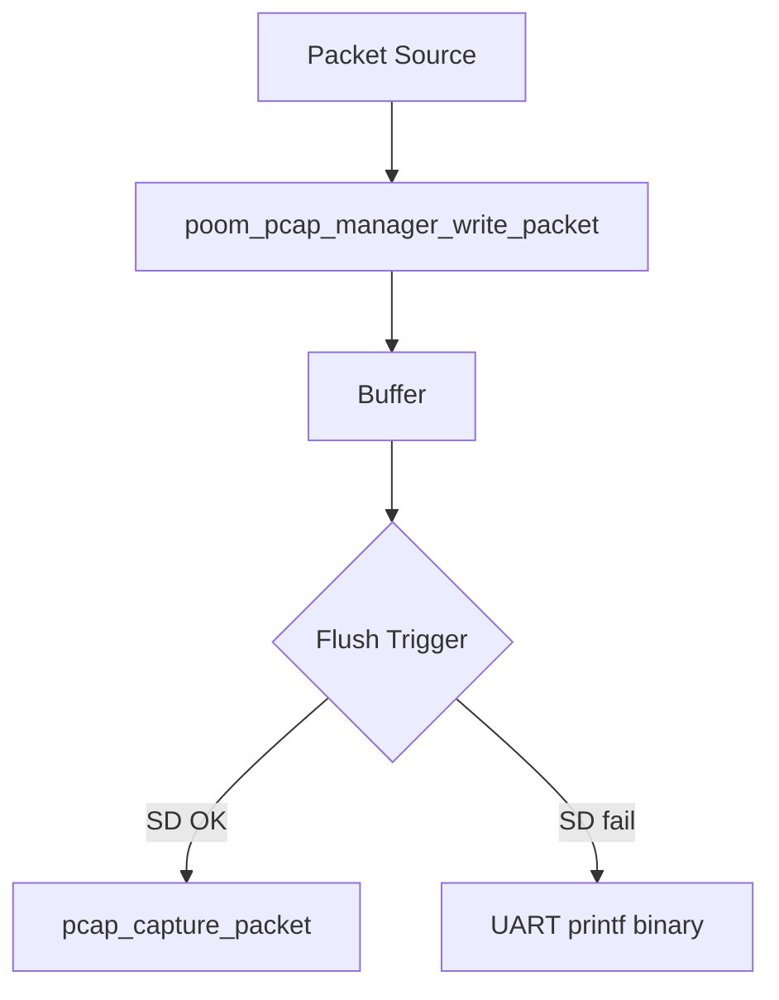

# poom_pcap

## Purpose
`poom_pcap` provides a buffered PCAP capture manager that can write to SD card files and/or emit raw PCAP bytes over UART using `printf`.

## Responsibilities
- Own the capture state (active/mode/type) and provide a simple public API.
- Buffer captured packets and flush them efficiently.
- Create PCAP files on SD with auto-incremented names (`capture_1.pcap`, `capture_2.pcap`, ...).
- Fall back to UART output when SD is unavailable (optional).
- Apply small framing adaptations (e.g. a minimal radiotap header for WiFi).
- (Optional) Provide capture helpers to keep protocol-specific code out of menus.

## Features
- SD file output using the `pcap` backend (`pcap_new_session`, `pcap_write_header`, `pcap_capture_packet`).
- UART output using only `printf`, with optional markers: `[BUFFER/INIT]` / `[BUFFER/CLOSE]`.
- Stream mode: raw binary PCAP over UART without markers.
- Capture types:
  - WiFi (adds radiotap)
  - Bluetooth (DLT configured by the manager; payload is user-provided)
  - IEEE 802.15.4 (NOFCS)

## Public API Overview
- `poom_pcap_manager_init`
- `poom_pcap_manager_start_auto`
- `poom_pcap_manager_start_file`
- `poom_pcap_manager_start_uart`
- `poom_pcap_manager_start_stream`
- `poom_pcap_manager_write_packet`
- `poom_pcap_manager_flush`
- `poom_pcap_manager_close`
- `poom_pcap_manager_get_file_path`
- `poom_pcap_manager_wifi_start_monitor_mode` (helper)
- `poom_pcap_manager_wifi_stop_monitor_mode` (helper)
- `poom_pcap_manager_sniffer_start_wifi` (helper)
- `poom_pcap_manager_sniffer_start_ble` (helper)
- `poom_pcap_manager_sniffer_start_zigbee` (helper)
- `poom_pcap_manager_sniffer_stop` (helper)
- `poom_pcap_manager_sniffer_zigbee_set_channel` (helper)
- `poom_pcap_manager_sniffer_zigbee_get_channel` (helper)
- `poom_pcap_manager_sniffer_zigbee_get_rssi` (helper)

## File Structure
- `poom_pcap_manager.c`: implementation (buffer, flush, SD/UART outputs)
- `include/poom_pcap_manager.h`: public API
- `poom_pcap_capture.c`: sniffer helpers (WiFi/BLE/Zigbee) built on the manager
- `CMakeLists.txt`: component registration
- `ejemplo.c` / `ejemplo.h`: legacy reference (not used by the build)

## Dependencies
- `pcap` (backend component in `third-party/pcap`)
- `sd_card` (driver in `drivers/sd_card`)
- FreeRTOS (mutex)

## Output Notes
- SD file paths are created under the mount root `SD_CARD_PATH` (typically `/sdcard`), for example:
  - `/sdcard/pcaps/capture_1.pcap`
- UART/stream outputs are **binary** PCAP bytes printed through `printf("%c", ...)`.
  - Host tooling must capture raw UART bytes (not line-based text).
  - UART-marker mode wraps each flush with `[BUFFER/INIT]` and `[BUFFER/CLOSE]`.

## Configuration Options
No dedicated Kconfig options are required.

## Logging Behavior
This module uses `printf` for warnings/errors and does not depend on `esp_log`.

## Zigbee / IEEE 802.15.4 Note
The Zigbee sniffer helper consumes IEEE 802.15.4 frames via the global callback
symbol `esp_ieee802154_receive_done(...)` required by the IEEE 802.15.4 driver.
This firmware implements that symbol in `poom_scanner_core` and `poom_pcap`
registers an ISR consumer during Zigbee capture.

## Usage Example
```c
#include "poom_pcap_manager.h"

void app_main(void)
{
    poom_pcap_manager_init(NULL);
    poom_pcap_manager_start_auto(POOM_PCAP_CAPTURE_WIFI);

    /* ... from your capture callback ... */
    /* poom_pcap_manager_write_packet(frame, frame_len, POOM_PCAP_CAPTURE_WIFI); */
}
```

## Runtime Flow

