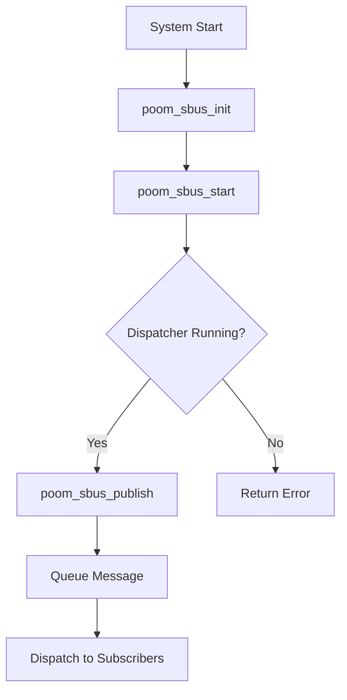

# poom_sbus

## Purpose
`poom_sbus` is a lightweight in-device publish/subscribe message bus for FreeRTOS tasks.

## Responsibilities
- Maintain a fixed-size topic registry.
- Manage callback subscriptions per topic.
- Dispatch published messages asynchronously through a queue and a worker task.

## Features
- Fixed memory model (no heap allocation per publish).
- Single dispatcher task with FIFO queue.
- Multi-subscriber topic delivery.
- Duplicate subscription protection.

## Public API
- `poom_sbus_init`
- `poom_sbus_start`
- `poom_sbus_register_topic`
- `poom_sbus_subscribe_cb`
- `poom_sbus_unsubscribe_cb`
- `poom_sbus_publish`

## Structure
- `poom_sbus.c`: dispatcher, registry, and message routing.
- `include/poom_sbus.h`: public types, limits, and API.
- `CMakeLists.txt`: ESP-IDF registration.

## Integration Notes
- Call `poom_sbus_start()` before first `poom_sbus_publish()`.
- Handlers execute in the dispatcher task context.
- Keep handlers short and non-blocking.

## Configuration Options
Compile-time limits are exposed in `poom_sbus.h`:
- `POOM_SBUS_MAX_TOPICS`
- `POOM_SBUS_MAX_HANDLERS_PER_TOPIC`
- `POOM_SBUS_MSG_DATA_SIZE`
- `POOM_SBUS_DISPATCH_QUEUE_DEPTH`

## Logging
This module does not emit runtime logs by default.

## Usage
```c
static void button_handler(const poom_sbus_msg_t *msg, void *user)
{
    (void)user;
    // process msg->data
}

poom_sbus_init();
poom_sbus_start(4, 4096);
poom_sbus_register_topic("input/button");
poom_sbus_subscribe_cb("input/button", button_handler, NULL);
```

## Runtime Flow

