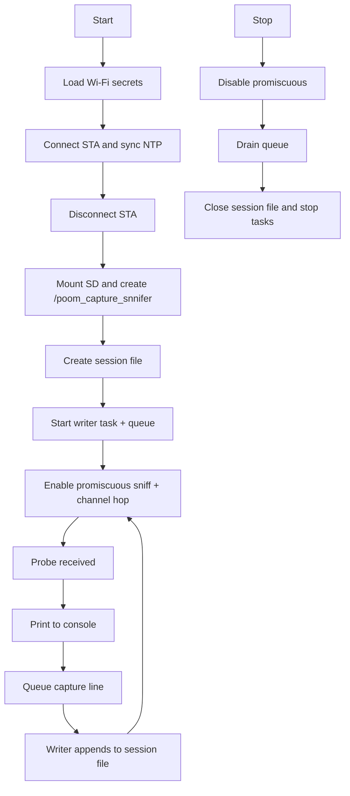

# poom_sniffer_device

`poom_sniffer_device` is a Wi-Fi probe-request sniffer component with optional SD capture logging.

## Purpose

- Sniff 802.11 management probe requests in promiscuous mode.
- Print detected device data to console (MAC, SSID, timestamp, hash, RSSI, sequence, HT info, channel).
- Try Wi-Fi connect from stored secrets only to sync RTC via NTP, then disconnect and continue in promiscuous mode.
- Store captures into SD card under a session file.

## Structure

```text
modules/poom_sniffer_device
├── CMakeLists.txt
├── README.md
├── include/
│   └── poom_sniffer_device.h
└── poom_sniffer_device.c
```

## Dependencies

Defined in `modules/poom_sniffer_device/CMakeLists.txt`:

- `poom_wifi_ctrl`
- `poom_secrets_store`
- `sd_card`
- `esp_wifi`
- `esp_netif`
- `freertos`

## Public API

Header: `modules/poom_sniffer_device/include/poom_sniffer_device.h`

```c
esp_err_t poom_sniffer_device_start(void);
esp_err_t poom_sniffer_device_stop(void);
esp_err_t poom_sniffer_device_get_running(bool *out_running);
```

## Runtime Behavior

1. `poom_sniffer_device_start()` checks state.
2. Loads stored Wi-Fi credentials from `poom_secrets_store`.
3. Attempts STA connect using `poom_wifi_ctrl`, syncs NTP (`pool.ntp.org`), disconnects STA.
4. Mounts SD (if needed) and ensures capture directory `/poom_capture_snnifer`.
5. Creates one capture file for the session and starts SD writer task.
6. Enables Wi-Fi promiscuous mode for management frames and starts channel hopping.
7. While running, each accepted probe is printed and appended to the same session file.
8. `poom_sniffer_device_stop()` stops sniffing, drains pending queue data, closes writer task/file, and returns.

## SD Layout

- Directory: `/sdcard/poom_capture_snnifer`
- Behavior: one file per RUN session, appended while session is active

## Flowchart



## Notes

- The capture hash is a compact FNV-style hash from `MAC + SSID`.
- Timestamp is `unsynced` if RTC/NTP is not available.
