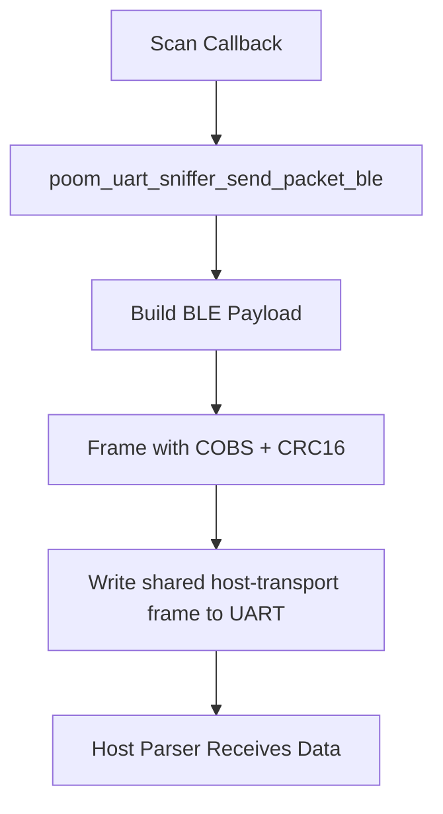

# poom_uart_sniffer

## Purpose
`poom_uart_sniffer` is a legacy compatibility wrapper that forwards BLE and generic packets
through the shared POOM host sniffer transport.

## Responsibilities
- Delegate framed UART output to `poom_host_sniffer_transport`.
- Encode BLE advertisement reports from GAP callbacks into host transport payloads.
- Keep module initialization/deinitialization state.

## Features
- Generic payload sender (`poom_uart_sniffer_send_packet`).
- BLE GAP advertisement sender (`poom_uart_sniffer_send_packet_ble`).
- BLE GAP report forwarding through the shared host transport format.

## Public API Overview
- `poom_uart_sniffer_send_packet`
- `poom_uart_sniffer_send_packet_ble`
- `poom_uart_sniffer_deinit`

## File Structure
- `poom_uart_sniffer.c`: framing and serialization logic.
- `include/poom_uart_sniffer.h`: public enum and API.
- `CMakeLists.txt`: component registration.

## Integration Notes
- Requires `bt` component for `esp_ble_gap_cb_param_t`.
- Call from BLE scan callback context only if UART throughput and timing are acceptable.
- Output is binary and intended for host parser tools.
- The transport framing now comes from `poom_host_sniffer_transport`.
- BLE advertising reports are converted into HCI H4 event packets before serialization.

## Protocol Note
`poom_uart_sniffer` no longer owns a custom transport framing.
It now emits packets through the shared POOM host sniffer transport:

- `COBS`
- `CRC16-CCITT`
- trailing `0x00`
- `VER | TYPE | CH | FLAGS | DLC | PAYLOAD | RSSI | STATUS`

## Configuration Options
No dedicated Kconfig options are required.

## Logging Behavior
This module does not emit runtime logs by default.

## Usage Example
```c
void gap_cb(esp_gap_ble_cb_event_t event, esp_ble_gap_cb_param_t *param)
{
    if(event == ESP_GAP_BLE_SCAN_RESULT_EVT)
    {
        poom_uart_sniffer_send_packet_ble(
            poom_uart_sniffer_packet_type_ble,
            param
        );
    }
}
```

## Runtime Flow

