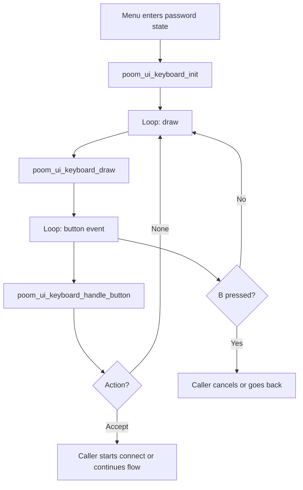

# poom_ui_keyboard

`poom_ui_keyboard` is a tiny on-screen keyboard (OSK) for POOM menus using the `poom_arduboy_display` drawing API.

It provides a small reusable keyboard state machine so multiple menus can collect text without each building a custom editor.

## Structure

```text
modules/poom_ui_keyboard
├── CMakeLists.txt
├── README.md
├── poom_ui_keyboard.c
└── include/
    └── poom_ui_keyboard.h
```

## Public API

Header:
`modules/poom_ui_keyboard/include/poom_ui_keyboard.h`

Typical caller flow uses:

* `poom_ui_keyboard_init()`
* `poom_ui_keyboard_handle_button()`
* `poom_ui_keyboard_draw()`

## Runtime Behavior

The keyboard provides:

* 3 rows of keys,
* D-pad navigation,
* selection with `A`,
* backspace,
* space,
* `ABC` / `123` mode switch,
* caps toggle,
* `OK` accept action.

The caller owns the surrounding screen state and decides what `B` means, usually cancel/back.

## Runtime Flow



## Integration

* `poom_ui_keyboard_draw()` renders the full modal and calls `poom_arduboy_display()`.
* Maximum text length is controlled by the caller through `text_cap`.
* The same keyboard state struct can be reused across menus and apps.
