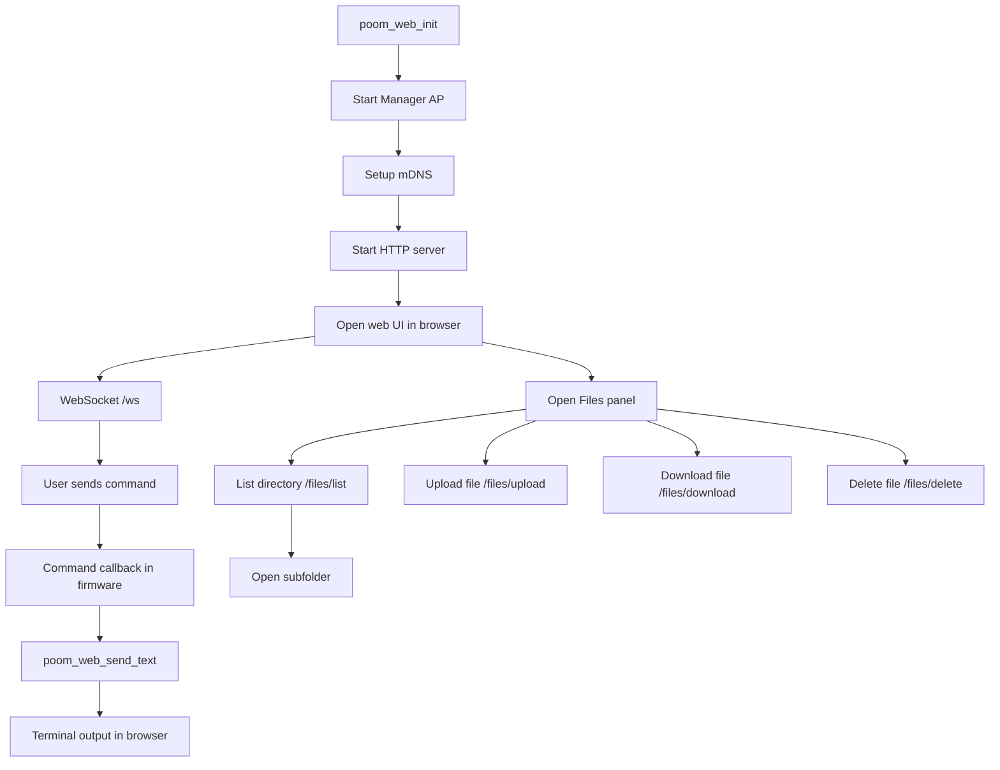

# poom_web

`poom_web` is a lightweight ESP32 web UI component that exposes:

- A browser terminal UI over HTTP.
- Command transport over WebSocket (`/ws`) with HTTP fallback (`/command`).
- SD card file manager from the same page (browse, upload, download, delete).

It follows the same modular style used in `poom_fw_update` and integrates with:

- `poom_wifi_ctrl` for AP lifecycle.
- `mdns_manager` for local hostname discovery.
- `esp_http_server` for static assets and API routes.

This component is used to upload files to the SD card and download files from the SD card through the web interface.

## Main Capabilities

- Starts Manager AP and HTTP service with one call: `poom_web_init()`.
- Serves embedded assets:
  - `/` -> terminal page
  - `/app.css`
  - `/app.js`
- Supports WebSocket terminal output push from firmware.
- Supports SD card navigation in subfolders (not only root).
- Supports file upload and file download directly from the web UI.
- Validates and sanitizes relative file paths for API access.

## Public API

- `esp_err_t poom_web_init(void);`
- `esp_err_t poom_web_deinit(void);`
- `esp_err_t poom_web_set_command_cb(poom_web_command_cb_t cb, void* user_ctx);`
- `esp_err_t poom_web_send_text(const char* text);`
- `const char* poom_web_get_wifi_ap_ssid(void);`
- `const char* poom_web_get_wifi_ap_password(void);`

Compatibility:
- `poom_cli_web` symbols are kept as header-only shims (`include/poom_cli_web.h`) for existing code.

## HTTP Endpoints

- `GET /capabilities`
  - Returns transport support status (WebSocket enabled/disabled).
- `POST /command`
  - Command fallback when WebSocket is unavailable.
- `GET /files/list?dir=<relative_dir>`
  - Lists entries in `/sdcard/<relative_dir>`.
  - `dir` is optional. Empty means root `/sdcard`.
- `POST /files/upload?path=<relative_file_path>`
  - Uploads binary body to `/sdcard/<relative_file_path>`.
- `GET /files/download?path=<relative_file_path>`
  - Downloads `/sdcard/<relative_file_path>`.
- `DELETE /files/delete?path=<relative_file_path>`
  - Deletes `/sdcard/<relative_file_path>`.

Compatibility note:
- `name=<filename>` is still accepted by file endpoints for root-level legacy calls.

## Folder Layout

```text
modules/poom_web/
├── CMakeLists.txt
├── component.mk
├── poom_web.c
├── README.md
├── include/
│   ├── poom_web.h
│   ├── poom_web_log.h
│   ├── poom_cli_web.h        # compatibility shim
│   └── poom_cli_web_log.h    # compatibility shim
├── modules/http_server/
│   ├── poom_web_http_server.c
│   ├── poom_web_http_server.h
│   └── poom_cli_web_http_server.h  # compatibility shim
└── src/webpage/
    ├── poom_cli_web_index.html
    ├── poom_cli_web_app.css
    └── poom_cli_web_app.js
```

## Runtime Flow



## Integration Example

```c
#include "poom_web.h"

static void cli_web_command_cb_(const char* command, void* user_ctx) {
    (void)user_ctx;
    if(command != NULL) {
        poom_web_send_text("OK\n");
    }
}

void app_start_cli_web(void) {
    (void)poom_web_set_command_cb(cli_web_command_cb_, NULL);
    (void)poom_web_init();
}
```

## Operational Notes

- If browser changes are not visible, force reload (`Ctrl+F5`) to bypass cached JS/CSS.
- File manager uses `/sdcard` as root and supports nested directory navigation.
- The component tries to mount SD card during init; if mount fails, terminal still works and file API returns availability errors.

Web interface reference: https://github.com/geo-tp/ESP32-Bus-Pirate/tree/pioarduino
