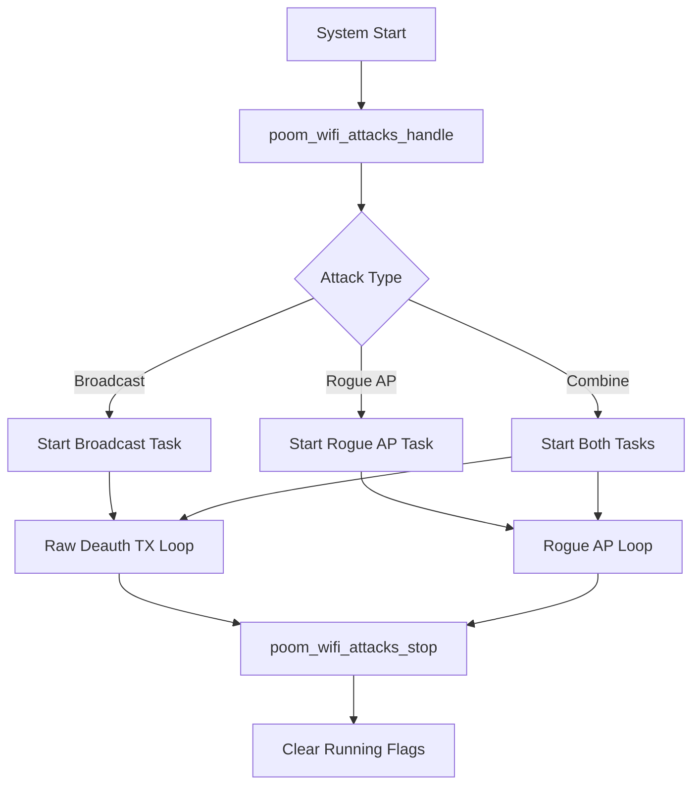

# poom_wifi_attacks

`poom_wifi_attacks` provides low-level Wi-Fi attack primitives used by POOM applications such as `poom_wifi_deauth`.

## Purpose

- Start and stop broadcast deauthentication attack flows.
- Start and stop rogue AP cloning flows.
- Execute combined mode (broadcast + rogue AP).
- Expose a simple API for upper menu/application layers.

## Responsibilities

- Build and send raw deauthentication frames.
- Switch Wi-Fi runtime mode using `poom_wifi_ctrl`.
- Spawn and manage attack tasks.
- Keep attack state flags for controlled shutdown.

## Features

- Single-shot broadcast deauth send.
- Continuous broadcast deauth loop.
- Rogue AP start with target SSID/channel/BSSID clone.
- Combined attack mode.
- Link-time override for `ieee80211_raw_frame_sanity_check`.

## Public API

- `void poom_wifi_attacks_handle(poom_wifi_attacks_type_t attack_type, wifi_ap_record_t *ap_target);`
- `void poom_wifi_attacks_stop(void);`
- `int poom_wifi_attacks_get_attack_count(void);`
- `void poom_wifi_attacks_broadcast_once(wifi_ap_record_t *ap);`

## Structure

```text
modules/poom_wifi_attacks
├── CMakeLists.txt
├── README.md
├── poom_wifi_attacks.c
└── include/
    └── poom_wifi_attacks.h
```

## Integration Notes

- Add `poom_wifi_attacks` to `REQUIRES` in dependent components.
- Include header as:
  - `#include "poom_wifi_attacks.h"`
- Attack target must be a valid `wifi_ap_record_t`.

## Configuration Options

- Logging gate macro used by this component:
  - `CONFIG_POOM_WIFI_ATTACKS_ENABLE_LOG`

No component-specific `Kconfig` file is required.

## Logging

When `CONFIG_POOM_WIFI_ATTACKS_ENABLE_LOG` is enabled, logs are emitted with:
- Tag: `poom_wifi_attacks`
- Macros: `POOM_PRINTF_E`, `POOM_PRINTF_W`, `POOM_PRINTF_I`, `POOM_PRINTF_D`

## Usage

```c
#include "poom_wifi_attacks.h"

void run_deauth_example(wifi_ap_record_t *target)
{
    poom_wifi_attacks_broadcast_once(target);
    poom_wifi_attacks_handle(poom_wifi_attacks_type_broadcast, target);
}
```

## Runtime Flow


