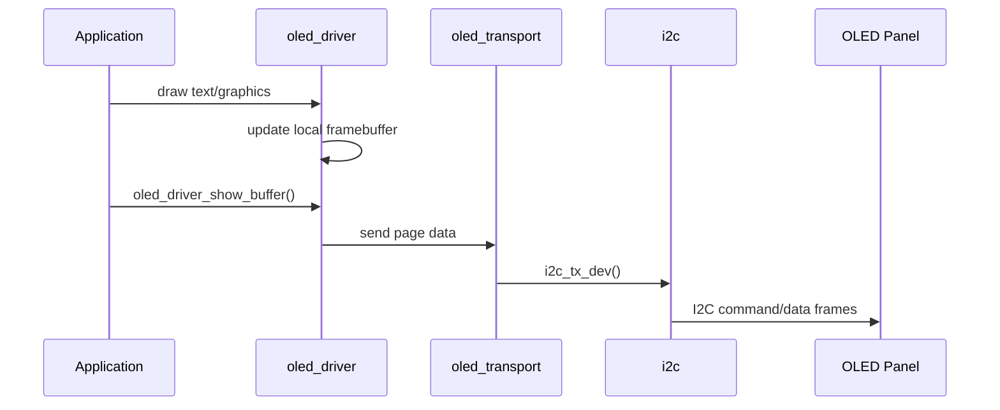

# oled

`oled` provides a framebuffer-based OLED driver and an I2C transport layer for SSD1306 displays.

## Structure

```text
drivers/oled
├── CMakeLists.txt
├── component.mk
├── include/
│   ├── font8x8_basic.h
│   ├── oled_def.h
│   ├── oled_driver.h
│   └── oled_transport.h
├── oled_driver.c
└── oled_transport.c
```

## Dependencies

- `driver`
- `i2c`
- `board`

## Public API

Main drawing API:
- `oled_driver_init`
- `oled_driver_show_buffer`
- `oled_driver_display_text`
- `oled_driver_draw_*`

Transport API:
- `oled_transport_init`
- `oled_transport_display_image`

## Usage

```c
#include "oled_driver.h"

void app_main(void)
{
    oled_driver_t oled = {0};
    oled_driver_init(&oled, 128, 64);
    oled_driver_clear_screen(&oled, false);
    oled_driver_display_text(&oled, 0, "Hello", 0, false);
    oled_driver_show_buffer(&oled);
}
```

## Runtime Flow


