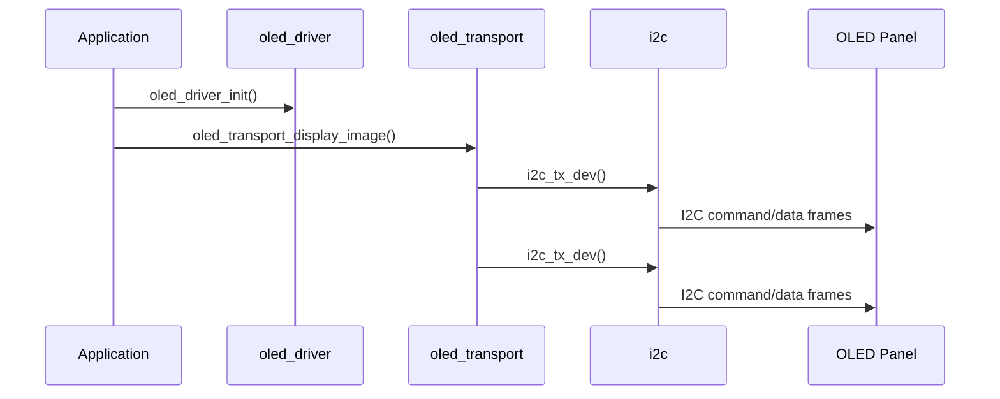

# oled

`oled` provides a minimal SSD1306 I2C transport layer, plus a small init helper (`oled_driver_init`).

## Folder Layout

```text
drivers/oled
├── CMakeLists.txt
├── component.mk
├── include/
│   ├── oled_def.h
│   ├── oled_driver.h
│   └── oled_transport.h
├── oled_driver.c
└── oled_transport.c
```

## Dependencies

- `driver`
- `i2c`
- `board`

## Public API

- `oled_driver_init`
- `oled_transport_init`
- `oled_transport_display_image`

## Quick Start

```c
#include "oled_driver.h"

void app_main(void)
{
    oled_driver_t oled = {0};
    oled_driver_init(&oled, 128, 64);

    // Rendering is handled by higher-level modules (e.g. poom_arduboy_display).
}
```

## Data Flow


